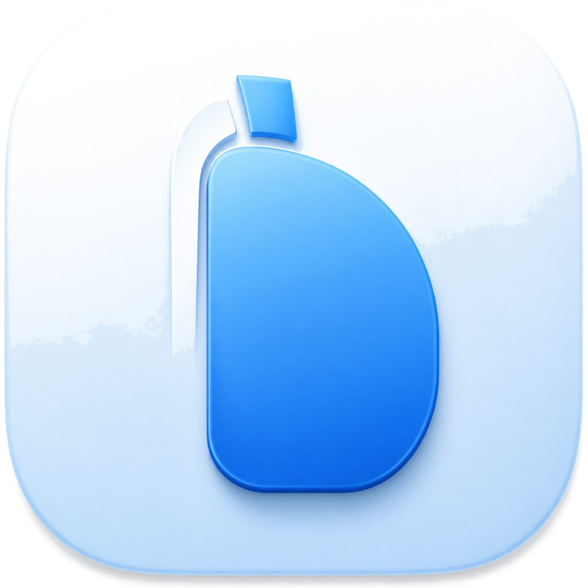

  

<h1 align="center">Clambhook</h1>

A private connectivity client with local status views.

Clambhook helps manage user-defined connectivity profiles and shows local status, counters, and recent activity summaries.

## macOS Scope

The macOS app uses Network Extension packet tunnel mode for device-wide routing. It embeds a macOS system extension, starts a `NETunnelProviderManager` packet tunnel, and routes packets through the shared mobile tunnel runtime. System proxy mode remains available as a daemon-backed fallback through the approved privileged helper or user-session daemon for apps and environments that should only use macOS HTTP, HTTPS, and SOCKS proxy settings. See `docs/macos-v1-scope.md`.

## End-user Distribution

The end-user macOS app is distributed only from `https://jpfchang.org/clambhook/`. It is a direct website download for Apple Silicon Macs running macOS 14 or later, with a two-month free trial and direct-sale licensing handled on jpfchang.org. The USD 99.99 direct-sale macOS license includes one year of feature updates; versions released during that year remain usable after the update year ends; it covers up to 4 active Apple Silicon Macs and is transferable between devices. A USD 8.99 paid feature update unlocks new features released after the included first year and extends the update window by one year.

Official public website routes:

- Product: `https://jpfchang.org/clambhook/`
- Download: `https://jpfchang.org/clambhook/download/`
- Buy or upgrade: `https://jpfchang.org/clambhook/buy/`
- License portal: `https://jpfchang.org/clambhook/portal/`
- License terms: `https://jpfchang.org/clambhook/license/`
- Privacy policy: `https://jpfchang.org/clambhook/privacy/`
- Support: `https://jpfchang.org/clambhook/support/`

ClambHook is not distributed to end users through app marketplaces, GitHub Releases, Homebrew, package registries, or third-party mirrors. Other platform builds are internal developer QA targets until a separate distribution plan is approved.

GitHub is source-only and view-only for end users. The source is proprietary to Pengfan Chang, all rights reserved, and may not be copied, modified, built, run, contributed to, redistributed, packaged, released, hosted, sublicensed, or used to create derivative works without separate prior written permission from Pengfan Chang.

Do not publish or link end-user installers or package artifacts from GitHub, including `.dmg`, `.pkg`, `.apk`, `.aab`, `.ipa`, Homebrew formula releases, Debian packages, or macOS installer artifacts. Other official builds are distributed only through Pengfan Chang's controlled channels. Only Pengfan Chang may distribute, publish, package, or release Clambhook artifacts.

The Android app should use Swift for common domain logic as much as practical in a future migration. Keep Kotlin for Android lifecycle, Compose UI, billing, services, storage, JNI/glue, and Gradle integration unless the Android Swift toolchain plan changes.

## Donate

 
