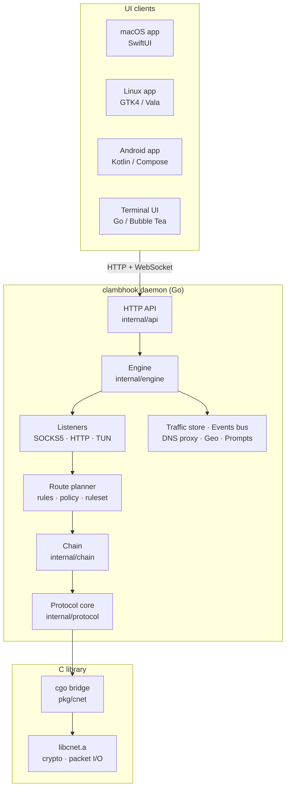
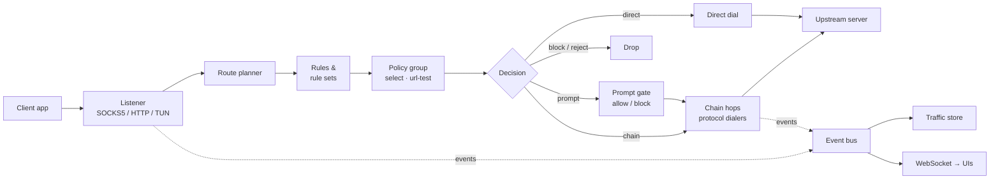
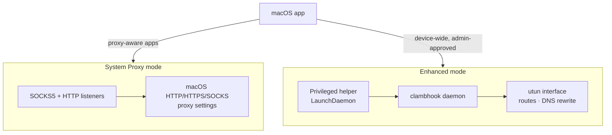
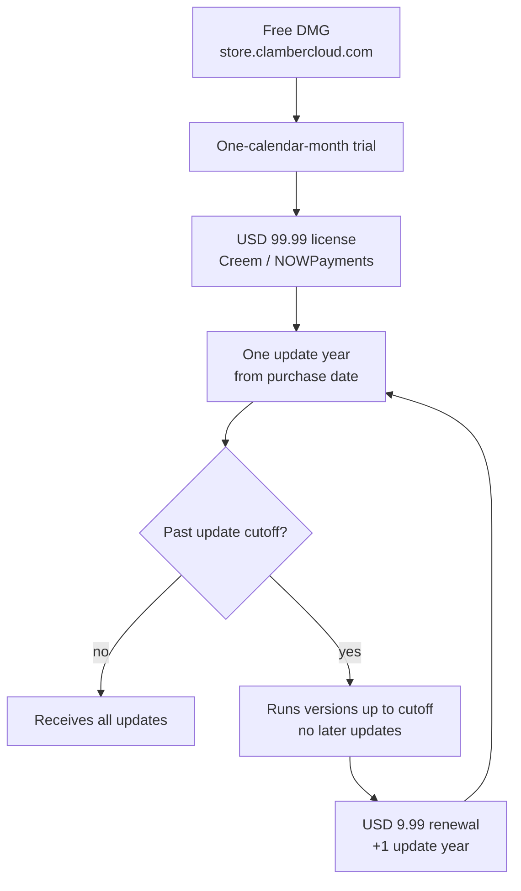

  

<h1 align="center">Clambhook</h1>

A private VPN and proxy router with local, metadata-first inspection.

---

## Overview

Clambhook is a macOS-first VPN and proxy router that supports proxy, tunnel, and
anonymity protocols with local inspection for routing and connection review. It
implements its own protocol core from scratch — it does not wrap sing-box,
mihomo, or any other existing engine. The backend is written in Go and C; the
macOS v1 client is a native SwiftUI app.

Activity inspection is metadata-only by default. Opt-in HTTP(S) capture adds a
Proxyman-style debugging surface; HTTPS body capture requires a user-trusted
local certificate authority and is intended only for devices and test traffic
the user controls.

## Architecture

Clambhook is layered as native UI clients over a single Go daemon, with a small
C library for performance-critical paths.

- **Go** — protocol core, chain orchestration, configuration parsing, listeners,
  the HTTP API, and the terminal UI.
- **C** — performance-critical paths reached through the `pkg/cnet` cgo bridge:
  packet processing, cryptographic operations, and low-level network I/O.
  Requires `libsodium` discoverable through `pkg-config`.

### Connection data flow

Every connection is admitted by a listener, resolved to a chain by the route
planner, then dialed hop by hop through the configured protocols. Lifecycle and
byte-count events flow onto the event bus for the traffic store and live UI
subscribers.

## Protocols

The protocol core registers dialers through the `internal/protocol` registry
using stable lowercase identifiers.

| Protocol | Identifier | Status |
| --- | --- | --- |
| Trojan | `trojan` | Implemented |
| ClambBack | `clambback` | Implemented |
| Shadowsocks | `shadowsocks` | Implemented |
| WireGuard | `wireguard` | Implemented |
| OpenVPN | `openvpn` | Implemented |
| Tor | `tor` | Implemented |
| VLESS | `vless` | Planned |
| VMess | `vmess` | Planned |
| Reality | `reality` | Planned |

Chains route through one or more hops, and policy groups select between chains by
manual choice or automatic latency testing (`url-test`).

## Features

- Own protocol core supporting proxy, tunnel, and anonymity protocols.
- Multi-hop chain proxying with `select` and `url-test` policy groups.
- Metadata-only activity inspection: connection targets, routing decisions, byte
  counts, and hop status.
- Rule-based routing with reusable rule sets, remote rule subscriptions, and
  per-process matchers.
- Little Snitch-style interactive connection prompts for local-proxy traffic.
- Opt-in HTTP(S) capture with body previews, HAR export, repeat/compose, map
  rules, and breakpoints.
- Encrypted DNS (DoH / DoT / DoQ) with local answering in TUN mode, including a
  first-class `controld` upstream so end users can plug in their own Control D
  resolver by id.
- Server geolocation display and emoji support in configuration profiles.

## macOS modes

The macOS app uses daemon-backed routing and does not embed Apple's Network
Extension or System Extension targets.

- **System Proxy mode** exposes local SOCKS5 and HTTP listeners and optionally
  points macOS proxy settings at them. It covers only apps that honor macOS
  proxy settings.
- **Enhanced mode** runs the privileged daemon with a utun interface for
  device-wide routing, installing routes and temporarily rewriting DNS when
  encrypted DNS is enabled. It requires admin approval for the helper.

See [`docs/macos-v1-scope.md`](docs/macos-v1-scope.md) for the full scope.

## Platforms

| Platform | UI framework | Status |
| --- | --- | --- |
| macOS 14+ (Apple Silicon) | SwiftUI | Public release |
| GNU/Linux (Debian, Fedora, Guix) | GTK4 / libadwaita (Vala) | Internal developer QA |
| Windows 11 | — | Discontinued (no planned resumption) |
| Android 12+ | Kotlin / Compose | Internal developer QA |

macOS supports menu bar integration and widgets.

### Terminal UI

Clambhook includes a built-in terminal UI (`bin/clambhook-tui`), tested on Apple
Terminal, PowerShell, GNOME Terminal, Xfce Terminal, and KDE Konsole.

## Building

The build uses `CGO_ENABLED=1` and requires `libsodium` discoverable through
`pkg-config`.

| Command | Result |
| --- | --- |
| `make build` | Builds `clib/libcnet.a`, then both Go binaries into `bin/`. |
| `make build-daemon` | Builds only `bin/clambhook`. |
| `make build-tui` | Builds only `bin/clambhook-tui`. |
| `make test` | Runs `go test ./...`. |
| `make lint` | Runs `go vet ./...` (and `staticcheck` when installed). |
| `make clean` | Removes `bin/` and build artifacts. |

A configuration template lives at [`configs/example.toml`](configs/example.toml).
See [`AGENTS.md`](AGENTS.md) for repository structure and contributor
conventions.

## Repository layout

| Path | Contents |
| --- | --- |
| `cmd/clambhook`, `cmd/clambhook-tui` | Daemon and terminal-UI entry points. |
| `internal/` | Core: protocols, chain, config, listeners, API, engine, geo. |
| `pkg/cnet`, `pkg/mobile` | cgo bridge and mobile embedding surface. |
| `clib/` | C static library (`src/`, `include/`). |
| `ui/apple`, `ui/linux`, `ui/android` | Native client apps. |
| `docs/` | Scope, roadmap, distribution, and release documentation. |
| `configs/` | Example configuration. |

## Distribution and licensing

The end-user macOS app is distributed only from `https://store.clambercloud.com/clambhook/`
as a free public DMG download for Apple Silicon Macs running macOS 14 or later. First launch
starts a one-calendar-month trial, after which a USD 99.99 one-time ClambHook license is
purchased from `https://store.swiphtgroup.com/clambhook/buy`.

The license includes one year of all updates from the purchase date; versions released
on or before the update cutoff remain usable after the cutoff. It covers a maximum of 10 concurrently active
devices across supported platforms, and seats can be deactivated for transfers. After the
cutoff, no later updates are included, including critical, bug, and security updates. A USD 9.99
renewal buys one additional update year, extending from the later of the current cutoff or the
renewal payment date. Purchase payments are accepted only through Creem or NOWPayments, not PayPal.

Official public routes:

- Product: `https://store.clambercloud.com/clambhook/`
- Download: `https://store.clambercloud.com/clambhook/download/`
- Buy or upgrade: `https://store.swiphtgroup.com/clambhook/buy/`
- License portal: `https://store.swiphtgroup.com/clambhook/portal/`
- License terms: `https://store.swiphtgroup.com/clambhook/license/`
- Privacy policy: `https://store.clambercloud.com/clambhook/privacy/`
- Support: `https://store.clambercloud.com/clambhook/support/`

Clambhook is not distributed to end users through app marketplaces, GitHub
Releases, Homebrew, package registries, or third-party mirrors. GNU/Linux and
Android builds are internal developer QA targets until a separate distribution
plan is approved. Windows development is discontinued with no planned resumption
date. See [`docs/distribution.md`](docs/distribution.md) and
[`docs/license-validation.md`](docs/license-validation.md).

GitHub is source-only and view-only for end users. Do not publish or link
end-user installers or package artifacts from GitHub, including `.dmg`, `.pkg`,
`.apk`, `.aab`, Homebrew formula releases, Debian packages, or macOS installer
artifacts. Only Pengfan Chang may distribute, publish, package, or release
Clambhook artifacts.

## License

Proprietary to Pengfan Chang, all rights reserved. The source may not be copied,
modified, built, run, contributed to, redistributed, packaged, released, hosted,
sublicensed, or used to create derivative works without separate prior written
permission from Pengfan Chang.

## Author

Pengfan Chang — clambhook@jpfchang.org

## Donate

