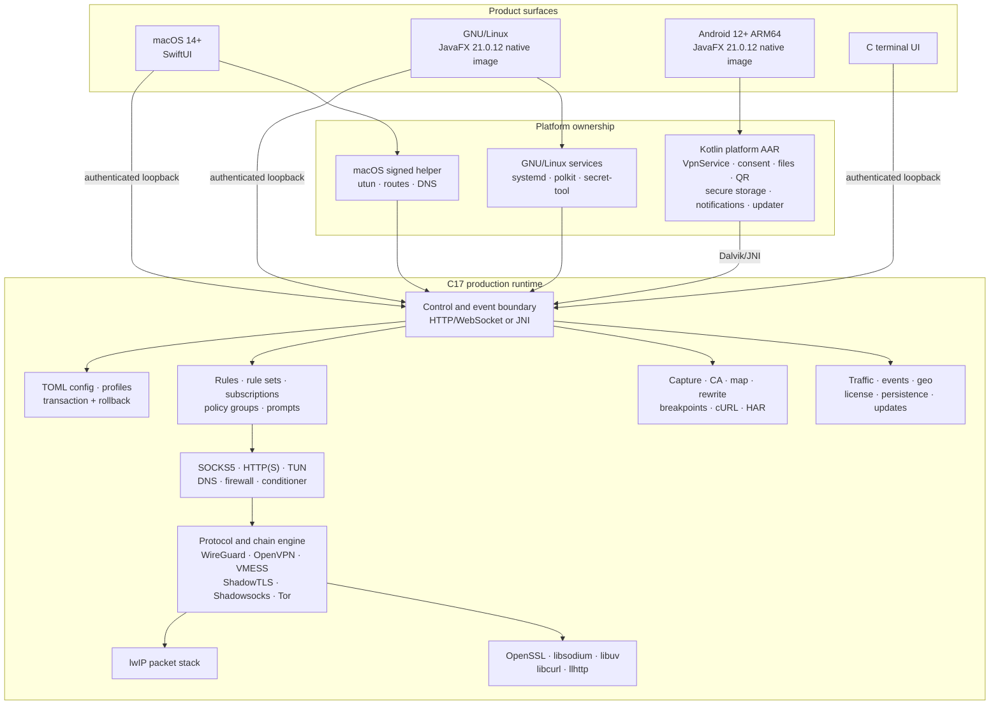
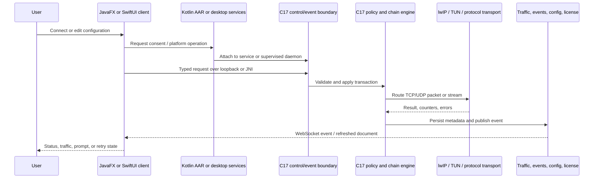
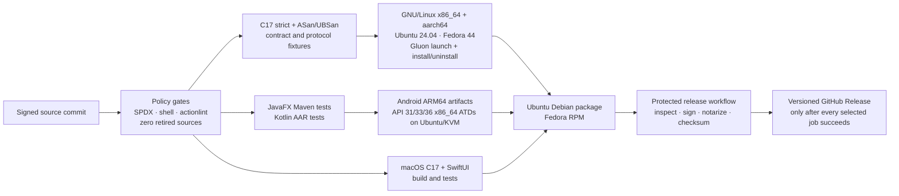
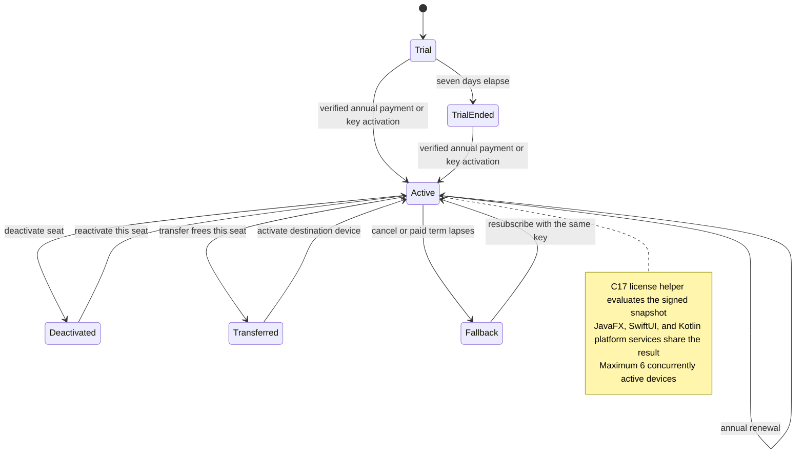

<!-- SPDX-FileCopyrightText: 2026 Pengfan Chang <support@swiphtgroup.com> -->
<!-- SPDX-License-Identifier: GPL-3.0-only -->

# ClambHook

> Privacy-focused VPN and proxy client plus a local HTTP(S) debugging and
> network-inspection tool for macOS (Apple Silicon), GNU/Linux (Ubuntu and
> Fedora), and Android — with SOCKS5, HTTP(S) proxy, WireGuard, OpenVPN,
> Shadowsocks, VMESS, ShadowTLS, Tor, and encrypted DNS (DoH/DoT/DoQ).

ClambHook is a local network-routing, privacy, and developer-inspection client.
Its production runtime is C17. Android and GNU/Linux share one JavaFX
application built with Gluon; macOS keeps its native SwiftUI client. A C daemon,
C terminal UI, and C license helper provide the command-line surface.

## What is ClambHook?

ClambHook is a cross-platform privacy and traffic-routing application for power
users and developers. It combines a VPN and proxy client (SOCKS5, HTTP(S)
proxy, and device-wide TUN routing over WireGuard, OpenVPN, Shadowsocks, VMESS,
ShadowTLS, and Tor) with an opt-in local HTTP(S) capture and debugging
workbench (body viewers, breakpoints, map/rewrite rules, cURL and HAR
export). Profiles, rules, credentials, keys, captures, and diagnostics stay on
the device unless you explicitly export them. Official builds are published only
on the [GitHub Releases page](https://github.com/JohnThre/clambhook/releases)
for Apple Silicon macOS 14+, Ubuntu and Fedora (x86_64 and aarch64), and ARM64
Android 12+.

The completed implementation cutover is recorded in
[outcome details](docs/c-migration.md).

The source tree contains protected release automation for every supported
platform. Official binaries appear only on the
[GitHub Releases page](https://github.com/JohnThre/clambhook/releases) after a
protected workflow finishes; a source version or tag alone is not evidence that
an installer has been published.

## Architecture

```mermaid
flowchart TB
    subgraph clients["Product surfaces"]
        mac["macOS 14+<br/>SwiftUI"]
        linux["GNU/Linux<br/>JavaFX 21.0.12 native image"]
        android["Android 12+ ARM64<br/>JavaFX 21.0.12 native image"]
        tui["C terminal UI"]
    end

    subgraph platform["Platform ownership"]
        macHelper["macOS signed helper<br/>utun · routes · DNS"]
        linuxServices["GNU/Linux services<br/>systemd · polkit · secret-tool"]
        kotlin["Kotlin platform AAR<br/>VpnService · consent · files · QR<br/>secure storage · notifications · updater"]
    end

    subgraph runtime["C17 production runtime"]
        control["Control and event boundary<br/>HTTP/WebSocket or JNI"]
        config["TOML config · profiles<br/>transaction + rollback"]
        routing["Rules · rule sets · subscriptions<br/>policy groups · prompts"]
        network["SOCKS5 · HTTP(S) · TUN<br/>DNS · firewall · conditioner"]
        protocols["Protocol and chain engine<br/>WireGuard · OpenVPN · VMESS<br/>ShadowTLS · Shadowsocks · Tor"]
        developer["Capture · CA · map · rewrite<br/>breakpoints · cURL · HAR"]
        support["Traffic · events · geo<br/>license · persistence · updates"]
        lwip["lwIP packet stack"]
        crypto["OpenSSL · libsodium · libuv<br/>libcurl · llhttp"]
    end

    mac -->|authenticated loopback| control
    mac --> macHelper
    linux -->|authenticated loopback| control
    linux --> linuxServices
    android --> kotlin -->|Dalvik/JNI| control
    tui -->|authenticated loopback| control
    control --> config
    control --> routing
    control --> developer
    routing --> network --> protocols
    protocols --> lwip
    protocols --> crypto
    control --> support
    macHelper --> control
    linuxServices --> control
```

The Java layer is split deliberately:

- `RuntimeClient` is a typed, asynchronous view of the frozen control and event
  contracts.
- `PlatformServices` owns platform-only behavior: VPN consent and lifecycle,
  files, QR, secure storage, clipboard/browser integration, notifications,
  licensing, updates, and Android per-application routing.
- On Android, `ClambhookVpnService` owns the single C runtime. Closing the
  JavaFX activity never destroys it.
- On GNU/Linux, the JavaFX native image communicates with the supervised C
  daemon over authenticated loopback HTTP and WebSocket endpoints.

## Runtime data flow

```mermaid
sequenceDiagram
    participant User
    participant UI as JavaFX or SwiftUI client
    participant Platform as Kotlin AAR or desktop services
    participant API as C17 control/event boundary
    participant Router as C17 policy and chain engine
    participant Tunnel as lwIP / TUN / protocol transport
    participant Store as Traffic, events, config, license

    User->>UI: Connect or edit configuration
    UI->>Platform: Request consent / platform operation
    Platform->>API: Attach to service or supervised daemon
    UI->>API: Typed request over loopback or JNI
    API->>Router: Validate and apply transaction
    Router->>Tunnel: Route TCP/UDP packet or stream
    Tunnel-->>Router: Result, counters, errors
    Router->>Store: Persist metadata and publish event
    Store-->>UI: WebSocket event / refreshed document
    UI-->>User: Status, traffic, prompt, or retry state
```

Configuration changes preserve the public TOML and JSON contracts and are
validated before atomic persistence. Listener, profile, rule, DNS, policy, and
developer changes roll back if activation fails.

## Network and protocol support

- SOCKS5, HTTP proxy, HTTPS interception when explicitly enabled, and
  device-wide TUN routing.
- Multi-hop chains and `select` or `url-test` policy groups.
- WireGuard over TCP/UDP routes with DNS, peer keys, allowed IPs, keepalive,
  MTU, replay protection, rekey, and lifecycle handling.
- OpenVPN 2.6+ UDP subset with TLS 1.2+, key-method 2/TLS-EKM,
  AES-256-GCM or ChaCha20-Poly1305, PKI, and optional username/password.
  TCP transport, CBC, compression, and legacy control modes are rejected.
- VMESS-AEAD, ShadowTLS v3, Shadowsocks AEAD-2018, Tor SOCKS5 isolation,
  direct routing, blocking, prompting, and chained transports.
- Encrypted DNS using DoH, DoT, or DoQ; local TUN answering and Control D
  resolver identifiers are supported.
- IPv4/IPv6 packet handling, fragmentation, flow/session tracking, tuple and
  checksum restoration, encrypted-DNS interception, and domain recovery use
  the shared lwIP-backed C packet stack.

## User features

- Connection state, profiles, import/export, QR workflows, servers, chains,
  activity, traffic, and routing decisions.
- Rules, temporary rules, policy groups, rule sets, remote subscriptions, and
  interactive prompts.
- DNS, firewall/TUN settings, capture, network conditioner, process matching,
  and per-application Android routing.
- Opt-in HTTP(S) capture with body viewers, filtering, timing, HAR export,
  repeat/send, cURL import/export, map rules, rewrite rules, and breakpoints.
- Licensing, update status, accessible keyboard navigation, focus semantics,
  responsive layouts, and background-thread-safe refresh/retry handling.

## Platforms

| Platform | Product UI | Runtime and packaging |
| --- | --- | --- |
| macOS 14+ Apple Silicon | SwiftUI | Bundled and signed C17 daemon/TUI; notarized DMG |
| GNU/Linux x86_64 and aarch64 | JavaFX 21.0.12 / GluonFX 1.0.29 | Self-contained native image beside C17 binaries; no bundled JRE |
| Android 12+ ARM64 | JavaFX 21.0.12 / GluonFX 1.0.29 | Kotlin platform AAR, JNI C runtime, signed APK and AAB; application ID `org.jpfchang.clambhook`, minSdk 31, targetSdk 36 |
| Terminal | C17 | `clambhook`, `clambhook-tui`, `clambhook-license` |

Windows development is discontinued with no planned resumption date.

## Build and test

The source build needs CMake 3.22+, Ninja, a C17 compiler, `pkg-config`,
OpenSSL 3, libsodium, libuv, and libcurl. The pinned llhttp parser is compiled
from `third_party/llhttp/`. JavaFX work uses Java 17 and Maven. Gluon
GNU/Linux native-image builds use the checksum-pinned GraalVM Community 17
toolchain provisioned by `scripts/provision-graalvm17.sh`. Android uses the
same provisioner with its `gluon` argument to select the CAP-cache-compatible,
checksum-pinned Gluon GraalVM 17 distribution.

JavaFX Maven dependencies are pinned at 21.0.12. Gluon's independently
published JavaFX 21 static ABI substrate is pinned at 21.0.1, the public bundle
available for every locked native target. GluonFX is pinned at 1.0.29. The
Linux AArch64 image is a GTK/X11 desktop build and excludes Gluon's separate
commercial DRM/framebuffer extension. Because Substrate 0.0.69 otherwise
selects its Raspberry Pi/Monocle backend for every AArch64 Linux target, the
build verifies and patches its single class-local backend selector inside an
isolated Maven repository. The AArch64 target triplet is unchanged, and
Gluon's checksum-pinned non-Monocle static SDK supplies the ordinary GTK
libraries. The desktop image includes JavaFX's software renderer as a fallback
for Xvfb, virtual machines, and systems without usable OpenGL. Monocle and DRM
archives are rejected before linking.

| Command | Purpose |
| --- | --- |
| `make build-native` | Build the production C17 daemon, TUI, and license helper. |
| `make test-native` | Run strict C tests under ASan/UBSan and the frozen license contract. |
| `make test-javafx` | Run JavaFX typed-client, model, state, and coverage tests. |
| `make test-android` | Test/lint the Kotlin AAR and build its ARM64 native payload. |
| `make build-android` | Build the shared Gluon Android application. |
| `make build-linux` | Build the host-architecture Gluon GNU/Linux native image. |
| `make build-apple` / `make test-apple` | Build and test the macOS SwiftUI client against the C runtime. |
| `make lint` | Run license/cutover checks, shell checks, warning-as-error C build, Java packaging, and Android lint. |
| `make ci-local` | Run the applicable local mirror of hosted CI. |

See [Android development](docs/android-development.md),
[Outline access keys](docs/outline-access-keys.md),
[Mihomo and Surge profile conversion](docs/profile-conversion.md),
[release validation](docs/release-validation.md), and
[packaging](packaging/README.md).

## CI, packages, and release

```mermaid
flowchart LR
    source["Signed source commit"] --> policy["Policy gates<br/>SPDX · shell · actionlint<br/>zero retired sources"]
    policy --> ctest["C17 strict + ASan/UBSan<br/>contract and protocol fixtures"]
    policy --> jvm["JavaFX Maven tests<br/>Kotlin AAR tests"]
    policy --> apple["macOS C17 + SwiftUI<br/>build and tests"]
    ctest --> linux["GNU/Linux x86_64 + aarch64<br/>Ubuntu 24.04 · Fedora 44<br/>Gluon launch + install/uninstall"]
    jvm --> android["Android ARM64 artifacts<br/>API 31/33/36 x86_64 ATDs on Ubuntu/KVM"]
    linux --> packages["Ubuntu Debian package<br/>Fedora RPM"]
    android --> packages
    apple --> packages
    packages --> protected["Protected release workflow<br/>inspect · sign · notarize · checksum"]
    protected --> releases["Versioned GitHub Release<br/>only after every selected job succeeds"]
```

Hosted distro and Android managed-device lanes are authoritative. Podman or
Docker is optional for local distro isolation. Apple's `container` CLI is not
used. Ordinary CI uploads reports only; installers are created and published
only by the protected release workflow.

Do not create a release by running build targets locally. Maintainers use
signed tags or an approved protected dispatch. See
[GitHub CI/CD](docs/github-cicd.md).

## Distribution and licensing

When available, official downloads are hosted only at
<https://github.com/JohnThre/clambhook/releases>. The protected workflow
publishes a notarized DMG for Apple Silicon Macs running macOS 14 or later,
signed ARM64 Android packages, and signed GNU/Linux packages. If the page has
no release, no official binary has been published yet; build locally or wait
for a protected release rather than obtaining an installer elsewhere.

The commercial product contract is:

- a 7-day trial for new installations; already-started month-long trials are grandfathered;
- a recurring USD 79.99 annual subscription;
- releases published during each paid term;
- versions released on or before the paid-through cutoff remain usable after cancellation or lapse;
- a maximum of 6 concurrently active devices;
- seats can be deactivated and transferred;
- cancellation stops future billing without revoking the paid term;
- resubscription can reuse the same provider-neutral license key;
- checkout uses Creem or NOWPayments, not PayPal.

```mermaid
stateDiagram-v2
    [*] --> Trial
    Trial --> Active: verified annual payment or key activation
    Trial --> TrialEnded: seven days elapse
    TrialEnded --> Active: verified annual payment or key activation
    Active --> Active: annual renewal
    Active --> Deactivated: deactivate seat
    Deactivated --> Active: reactivate this seat
    Active --> Transferred: transfer frees this seat
    Transferred --> Active: activate destination device
    Active --> Fallback: cancel or paid term lapses
    Fallback --> Active: resubscribe with the same key

    note right of Active
        C17 license helper evaluates the signed snapshot
        JavaFX, SwiftUI, and Kotlin platform services share the result
        Maximum 6 concurrently active devices
    end note
```

## Support independent development

Donations are separate from ClambHook subscriptions. They never create a
license, extend a paid term, grant a supporter badge, or change support
priority. You can donate through
[Ko-fi](https://ko-fi.com/jpfchang),
[Liberapay](https://en.liberapay.com/jpfchang/), or
[IssueHunt](https://oss.issuehunt.io/u/johnthre).

<a href="https://nowpayments.io/donation?api_key=4f798f1e-c93e-456e-8067-b03b200790cd" target="_blank" rel="noreferrer noopener" referrerpolicy="no-referrer">
  <picture>
    <source media="(prefers-color-scheme: dark)" srcset="https://nowpayments.io/images/embeds/donation-button-white.svg">
    
  </picture>
</a>

The first-party application is GPL-3.0-only, with separate written commercial
terms available. `clib/**` is Apache-2.0. Pinned third-party material retains
its upstream licenses and provenance. See [licensing](LICENSING.md),
[notice](NOTICE), and [third-party notices](THIRD_PARTY_NOTICES.md).

## Security and contribution

Report vulnerabilities privately as described in [SECURITY.md](SECURITY.md).
Contributions require the agreement in [CLA.md](CLA.md), SPDX headers, tests,
and preservation of the published control, persistence, identifier, and
licensing contracts.

## Documentation map

- [Roadmap](docs/roadmap.md) and [project review](docs/project-review.md):
  delivered architecture, current priorities, and reviewed boundaries.
- [Android development](docs/android-development.md),
  [macOS scope](docs/macos-v1-scope.md), and the
  [JavaFX client](ui/javafx/README.md): platform ownership and toolchains.
- [Release validation](docs/release-validation.md),
  [GitHub CI/CD](docs/github-cicd.md), and
  [packaging](packaging/README.md): release evidence and artifact policy.
- [Distribution](docs/distribution.md), [licensing](LICENSING.md), and
  [security](SECURITY.md): public distribution, legal boundaries, and private
  vulnerability reporting.

## Frequently asked questions

### What platforms does ClambHook support?

Apple Silicon Macs running macOS 14 or later (native SwiftUI app), GNU/Linux on
Ubuntu and Fedora for x86_64 and aarch64 (JavaFX native image), and ARM64
Android 12+ (JavaFX app with a Kotlin platform layer). A C terminal UI is also
provided. Windows development is discontinued.

### Which protocols and features does ClambHook support?

SOCKS5, HTTP(S) proxy, device-wide TUN routing, WireGuard, OpenVPN 2.6+,
Shadowsocks, VMESS-AEAD, ShadowTLS v3, Tor, multi-hop chains, policy groups,
and encrypted DNS over DoH, DoT, or DoQ. It also includes an opt-in local
HTTP(S) capture and debugging workbench with body viewers, filtering, timing,
breakpoints, map rules, rewrite rules, repeat/compose, cURL import/export, and
HAR export.

### Is ClambHook free? What does it cost?

New installations get a 7-day trial, after which a recurring USD 79.99 annual
subscription is required. One subscription covers a maximum of 6 concurrently
active devices, seats can be deactivated and transferred, and versions released
on or before your paid-through cutoff remain usable after cancellation.
Checkout uses Creem or NOWPayments.

### Is ClambHook open source?

Yes. The first-party application is GPL-3.0-only, `clib/**` is Apache-2.0, and
separate written commercial terms are available. See [licensing](LICENSING.md).

### Where do I download official builds?

Official, signed builds are published only on the
[GitHub Releases page](https://github.com/JohnThre/clambhook/releases). A source
version or tag alone is not evidence that an installer has been published.

### How can I support ClambHook?

Donations are optional and separate from subscriptions. You can support the
project through [Ko-fi](https://ko-fi.com/jpfchang), [Liberapay](https://en.liberapay.com/jpfchang/),
[IssueHunt](https://oss.issuehunt.io/u/johnthre), or NOWPayments.

## Author

Pengfan Chang — <support@swiphtgroup.com>
