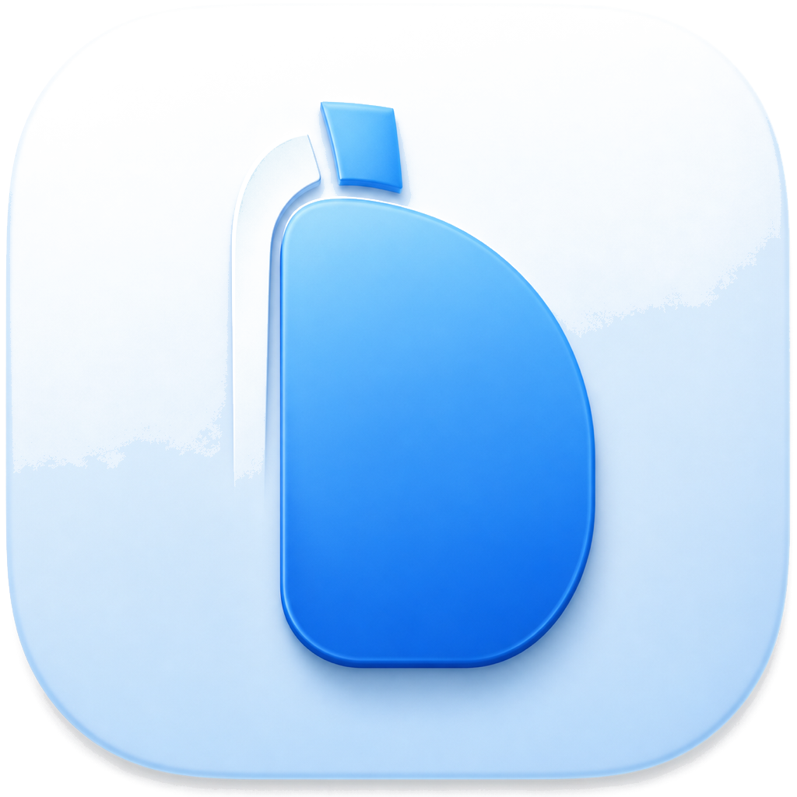
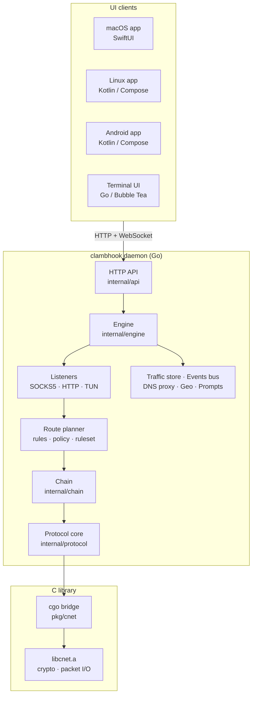
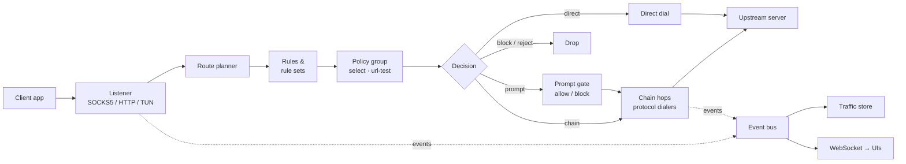
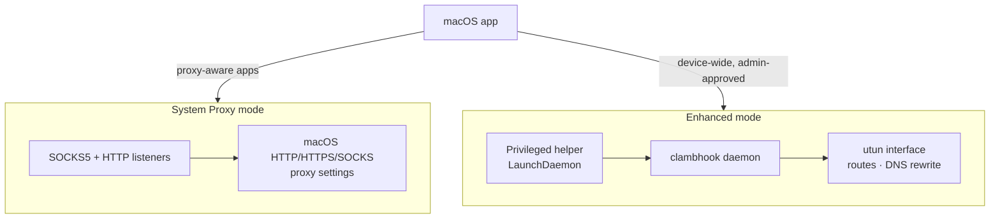
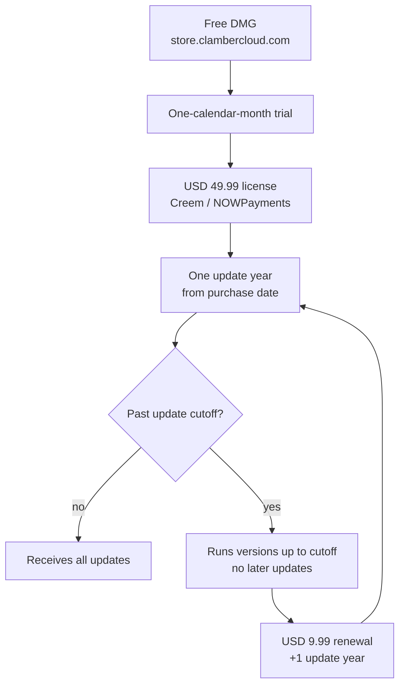
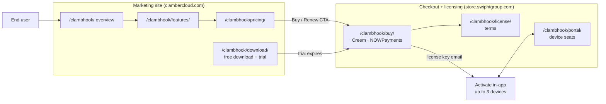

<p align="center">
  
</p>

<h1 align="center">Clambhook</h1>

<p align="center">A powerful personalized network tool with local, metadata-first inspection.</p>

---

## Overview

Clambhook is a powerful personalized network tool with local inspection for
routing and connection review. It implements its own protocol core from scratch.
A gated migration is replacing the Go runtime with C17, while the macOS client
remains SwiftUI, Android remains Kotlin/Jetpack Compose, and GNU/Linux moves to
C/GTK 4. See [`docs/c-migration.md`](docs/c-migration.md) for the live cutover
status and compatibility gates.

Activity inspection is metadata-only by default. Opt-in HTTP(S) capture adds a
Proxyman-style debugging surface; HTTPS body capture requires a user-trusted
local certificate authority and is intended only for devices and test traffic
the user controls.

## Architecture

The currently shipping clients still use the legacy daemon while an additive C
runtime is validated against it. Production names and packages switch only
after the parity gates pass.


```mermaid
graph TD
    subgraph clients["UI clients"]
        mac["macOS app<br/>SwiftUI"]
        linux["Linux app<br/>Kotlin / Compose"]
        android["Android app<br/>Kotlin / Compose"]
        tui["Terminal UI<br/>Go / Bubble Tea"]
    end

    subgraph daemon["clambhook daemon (Go)"]
        api["HTTP API<br/>internal/api"]
        engine["Engine<br/>internal/engine"]
        listeners["Listeners<br/>SOCKS5 · HTTP · TUN"]
        router["Route planner<br/>rules · policy · ruleset"]
        chain["Chain<br/>internal/chain"]
        protocols["Protocol core<br/>internal/protocol"]
        support["Traffic store · Events bus<br/>DNS proxy · Geo · Prompts"]
    end

    subgraph native["C library"]
        cnet["cgo bridge<br/>pkg/cnet"]
        clib["libcnet.a<br/>crypto · packet I/O"]
    end

    clients -->|HTTP + WebSocket| api
    api --> engine
    engine --> listeners --> router --> chain --> protocols
    engine --> support
    protocols --> cnet --> clib
```

- **Go** — protocol core, chain orchestration, configuration parsing, listeners,
  the HTTP API, and the terminal UI.
- **C** — performance-critical paths reached through the `pkg/cnet` cgo bridge:
  packet processing, cryptographic operations, and low-level network I/O.
  Requires `libsodium` discoverable through `pkg-config`.

### Connection data flow

Every connection is admitted by a listener, resolved to a chain by the route
planner, then dialed hop by hop through the configured protocols. Lifecycle and
byte-count events flow onto the event bus for the traffic store and live UI
subscribers.


```mermaid
flowchart LR
    app["Client app"] --> listener["Listener<br/>SOCKS5 / HTTP / TUN"]
    listener --> planner["Route planner"]

    planner --> rules["Rules &<br/>rule sets"]
    rules --> policy["Policy group<br/>select · url-test"]
    policy --> decision{Decision}

    decision -->|direct| direct["Direct dial"]
    decision -->|block / reject| drop["Drop"]
    decision -->|prompt| gate["Prompt gate<br/>allow / block"]
    decision -->|chain| chain["Chain hops<br/>protocol dialers"]

    gate --> chain
    chain --> upstream["Upstream server"]
    direct --> upstream

    listener -. events .-> bus["Event bus"]
    chain -. events .-> bus
    bus --> traffic["Traffic store"]
    bus --> ws["WebSocket → UIs"]
```

## Protocols

The protocol core registers dialers through the `internal/protocol` registry
using stable lowercase identifiers. Chains route through one or more hops, and
policy groups select between chains by manual choice or automatic latency
testing (`url-test`).

## Features

- Own protocol core supporting proxy, tunnel, and anonymity protocols.
- ShadowTLS (v3) transport obfuscation that wraps an inner protocol inside a
  genuine TLS 1.3 handshake, used as an entry hop in front of a proxy hop.
- Multi-hop chain proxying with `select` and `url-test` policy groups.
- Metadata-only activity inspection: connection targets, routing decisions, byte
  counts, and hop status.
- Rule-based routing with reusable rule sets, remote rule subscriptions, and
  per-process matchers.
- Little Snitch-style interactive connection prompts for local-proxy traffic.
- Opt-in HTTP(S) capture with body previews, daemon-side body viewers (pretty
  JSON/XML/form/HTML plus a hex dump, shared across every client), server-side
  flow filtering (method, status range, host, scheme, content type, errors, and
  free-text search), HAR export with connect/SSL/send/wait/receive timings,
  repeat and standalone compose/send, cURL import/export, map rules, and
  breakpoints.
- Encrypted DNS (DoH / DoT / DoQ) with local answering in TUN mode, including a
  first-class `controld` upstream so end users can plug in their own Control D
  resolver by id.
- Server geolocation display and emoji support in configuration profiles.

## macOS modes

The macOS app uses daemon-backed routing and does not embed Apple's Network
Extension or System Extension targets.


```mermaid
graph TD
    app["macOS app"]

    subgraph proxy["System Proxy mode"]
        pl["SOCKS5 + HTTP listeners"]
        ps["macOS HTTP/HTTPS/SOCKS<br/>proxy settings"]
        pl --> ps
    end

    subgraph enhanced["Enhanced mode"]
        helper["Privileged helper<br/>LaunchDaemon"]
        daemon["clambhook daemon"]
        utun["utun interface<br/>routes · DNS rewrite"]
        helper --> daemon --> utun
    end

    app -->|proxy-aware apps| proxy
    app -->|device-wide, admin-approved| enhanced
```

- **System Proxy mode** exposes local SOCKS5 and HTTP listeners and optionally
  points macOS proxy settings at them. It covers only apps that honor macOS
  proxy settings.
- **Enhanced mode** runs the privileged daemon with a utun interface for
  device-wide routing, installing routes and temporarily rewriting DNS when
  encrypted DNS is enabled. It requires admin approval for the helper.

See [`docs/macos-v1-scope.md`](docs/macos-v1-scope.md) for the full scope.

## Platforms

| Platform | UI framework | Status |
| --- | --- | --- |
| macOS 14+ (Apple Silicon) | SwiftUI | Public release |
| GNU/Linux (Ubuntu, Debian, Fedora) | C / GTK 4 target; Compose remains during parity | Public release |
| Android 11+ | Kotlin / Compose | Internal developer QA |

Windows development is discontinued with no planned resumption date.

macOS supports menu bar integration and widgets.

### Terminal UI

Clambhook includes a built-in terminal UI (`bin/clambhook-tui`), tested on Apple
Terminal, PowerShell, GNOME Terminal, Xfce Terminal, and KDE Konsole.

## Building

The legacy build uses `CGO_ENABLED=1`. The replacement C17 build uses CMake,
Ninja, and C dependencies discovered through `pkg-config`; see
[`docs/c-migration.md`](docs/c-migration.md).
The current native data-plane slice wires C SOCKS5 and HTTP proxy listeners to
native TOML and compiled routing rules. Direct routes and TCP-only Trojan,
clambback, Shadowsocks AEAD-2018, ShadowTLS v3 carrier, Tor SOCKS5, and modern
VMESS-AEAD chains, including nested encrypted hops, are operational. Native
VMESS covers raw TCP and TLS with AES-128-GCM or ChaCha20-Poly1305. The native
packet API also covers direct UDP and single-hop Shadowsocks AEAD-2018 UDP;
Trojan/clambback and modern VMESS-AEAD UDP are operational as single or final
stream-carried hops. The SOCKS5 listener exposes those paths through
asynchronous `UDP ASSOCIATE` sessions. Native process-rule attribution now maps
local TCP and UDP source sockets through `libproc` on macOS and `/proc` on
GNU/Linux; the listener skips that platform scan when no compiled rule uses a
process matcher. The native runtime also observes macOS interface/SSID and
GNU/Linux interface changes, reports them in status, and atomically selects the
first matching profile trigger with listener rollback on failure. WireGuard,
OpenVPN, DoQ, and platform VPN lifecycle stay guarded until
their parity tests pass. A pinned lwIP 2.2.1 C core now
provides the shared IPv4/IPv6 packet foundation on host platforms and all four
Android NDK ABIs. Native runtime/JNI lifecycle, configured MTU/CIDRs, ICMP
checksums, packet injection, and Kotlin callback output are covered. Bounded
IPv4/IPv6 TCP and UDP flows now route through native direct or encrypted
transports with tuple/checksum restoration, TCP backpressure, UDP session
reuse, encrypted-DNS port-53 interception, and TTL-bounded A/AAAA domain
recovery for rule matching. A bounded pre-routing reassembler rejects fragment
overlaps, expires incomplete IPv4/IPv6 datagrams, and supports common IPv6
option/routing/authentication extension chains. Android native transport
linkage and platform TUN lifecycle remain gated. The
additive native DNS library now provides route-planned DoH and DoT, Control D
expansion/bootstrap hygiene, response correlation validation, upstream
failover, and SERVFAIL generation; it deliberately rejects DoQ rather than
downgrading it. Runtime lifecycle/profile rollback now owns that proxy and
routes upstream streams through the same native rules and chains as listener
traffic.
Building, running, and testing require prior written permission from Pengfan
Chang; see [`LICENSE`](LICENSE). The commands below are for the author and
authorized parties, not a general contribution or redistribution grant.

| Command | Result |
| --- | --- |
| `make build` | Builds `clib/libcnet.a`, then both Go binaries into `bin/`. |
| `make build-daemon` | Builds only `bin/clambhook`. |
| `make build-tui` | Builds only `bin/clambhook-tui`. |
| `make test` | Builds `clib/libcnet.a`, then runs `go test ./...`. |
| `make build-native` | Builds the additive C17 runtime, daemon, helper, and native tests. |
| `make test-native` | Runs sanitizer-backed C tests and license differential parity. |
| `make build-linux-gtk` | Builds the additive C/GTK 4 GNU/Linux client. |
| `make build-android-native` | Builds the C/JNI runtime for the Android NDK ABIs. |
| `make test-android-compatibility` | Runs Compose instrumentation on managed API 30/33/36 devices. |
| `make lint` | Runs `go vet ./...` (and `staticcheck` when installed). |
| `make clean` | Removes `bin/` and build artifacts. |

A configuration template lives at [`configs/example.toml`](configs/example.toml).
See the [Repository layout](#repository-layout) section below and the
[`docs/`](docs/) directory for repository structure and conventions.

## CI/CD and testing

CI/CD and testing run on the local machine (macOS) plus Apple's
[`container`](https://github.com/apple/container) tool for GNU/Linux containers —
there are no GitHub Actions workflows and no Xcode Cloud integration in this
repo. GNU/Linux packages are validated across the three supported distributions
(Ubuntu, Debian, Fedora) from a Mac with:

```sh
container system start                       # one-time: start the Apple container service
scripts/validate-linux-distros.sh            # build + headless smoke in ubuntu/debian/fedora containers
```

`scripts/ci-local.sh` runs the full local gate across all platforms in sections
(`go`, `apple`, `android`, `linux`, `e2e`, `smoke`; default `all`), skipping any
section whose tooling is absent. Apple builds validate locally with
`make build-apple` and `make test-apple` (`swift test`); Android with
`make test-android`, `make lint-android`, and `make build-android` (plus an on-device AVD smoke when `CI_LOCAL_ANDROID_AVD=<name>` is set — Apple `container` is Linux-only and cannot run Android); the Go core
with `make test`, `make test-race`, and `make lint`. See
[`docs/release-validation.md`](docs/release-validation.md) for the full policy
and [`packaging/README.md`](packaging/README.md) for the container harness.

## Android development

Google's [`android`](https://developer.android.com/cli) CLI is the default tool
for Android development: SDK/NDK provisioning, emulator management, and
build-deploy-launch on a device or Android SDK Emulator (AVD) (`android run`, or `make run-android`).
Gradle is still used for unit tests (`make test-android`), lint
(`make lint-android`), and release assembly (`make build-android-release`)
because the `android` CLI has no equivalent commands. Gradle now packages the
NDK-built C/JNI library; the current gomobile AAR remains the selected rollback
runtime while `NativeClambhookBridge` advances through parity. See
[`docs/android-development.md`](docs/android-development.md) for the full guide.

## Repository layout

| Path | Contents |
| --- | --- |
| `cmd/clambhook`, `cmd/clambhook-tui` | Legacy daemon and terminal-UI parity oracles. |
| `internal/` | Core: protocols, chain, config, listeners, API, engine, geo. |
| `pkg/cnet`, `pkg/mobile` | cgo bridge and mobile embedding surface. |
| `clib/` | C static library (`src/`, `include/`). |
| `native/` | C17 runtime ABI, daemon, JNI bridge, helper, and native tests. |
| `ui/apple`, `ui/linux`, `ui/linux-gtk`, `ui/android` | Platform client apps and migration targets. |
| `docs/` | Scope, roadmap, distribution, and release documentation. |
| `configs/` | Example configuration. |

## Distribution and licensing

The end-user macOS app is distributed only from `https://store.clambercloud.com/clambhook/`
as a free public DMG download for Apple Silicon Macs running macOS 14 or later. The GNU/Linux
app is distributed only from the same host as free per-distro packages (`.deb` and `.rpm`)
tested on Ubuntu, Debian, and Fedora. First launch
starts a one-calendar-month trial, after which a USD 49.99 one-time ClambHook license is
purchased from `https://store.swiphtgroup.com/clambhook/buy`.

The license includes one year of all updates from the purchase date; versions released
on or before the update cutoff remain usable after the cutoff. It covers a maximum of 3 concurrently active
devices across supported platforms, and seats can be deactivated for transfers. After the
cutoff, no later updates are included, including critical, bug, and security updates. A USD 9.99
renewal buys one additional update year, extending from the later of the current cutoff or the
renewal payment date. Purchase payments are accepted only through Creem or NOWPayments, not PayPal.


```mermaid
flowchart TD
    download["Free DMG<br/>store.clambercloud.com"] --> trial["One-calendar-month trial"]
    trial --> buy["USD 49.99 license<br/>Creem / NOWPayments"]
    buy --> year["One update year<br/>from purchase date"]
    year --> cutoff{Past update cutoff?}
    cutoff -->|no| updates["Receives all updates"]
    cutoff -->|yes| frozen["Runs versions up to cutoff<br/>no later updates"]
    frozen --> renew["USD 9.99 renewal<br/>+1 update year"]
    renew --> year
```

### Web presence and commerce separation

ClambHook's public web presence is split across two independently deployed
sites, each with a single responsibility. All landing and marketing pages —
overview, features, pricing, download, privacy, and support — live on
**Clamber Cloud** (`clambercloud.com`). Every purchase, subscription, renewal,
and license-device action happens on the **Swipht Group store**
(`store.swiphtgroup.com`). Marketing pages never process payments; they deep-link
purchase calls-to-action to the store. This keeps the download/trial surface and
the payment/licensing surface cleanly isolated.


```mermaid
flowchart LR
    subgraph marketing["Marketing site (clambercloud.com)"]
        overview["/clambhook/ overview"]
        features["/clambhook/features/"]
        pricing["/clambhook/pricing/"]
        dl["/clambhook/download/<br/>free download + trial"]
    end

    subgraph store["Checkout + licensing (store.swiphtgroup.com)"]
        buy["/clambhook/buy/<br/>Creem · NOWPayments"]
        license["/clambhook/license/<br/>terms"]
        portal["/clambhook/portal/<br/>device seats"]
    end

    user["End user"] --> overview
    overview --> features --> pricing
    pricing -->|"Buy / Renew CTA"| buy
    dl -->|"trial expires"| buy
    buy -->|"license key email"| activate["Activate in-app<br/>up to 3 devices"]
    activate <--> portal
    buy --> license
```

- **Marketing / download (`clambercloud.com`):** product content, feature and
  pricing pages, and free downloads with the one-calendar-month trial. No
  checkout runs here; the payment CTA redirect is the only commerce coupling.
- **Checkout / licensing (`store.swiphtgroup.com`):** Creem and NOWPayments
  checkout, license-key delivery, update-year renewals, and the device-seat
  portal enforcing the 3 concurrently active device limit.

Official public routes:

- Product: `https://store.clambercloud.com/clambhook/`
- Download: `https://store.clambercloud.com/clambhook/download/`
- Features: `https://store.clambercloud.com/clambhook/features/`
- Pricing: `https://store.clambercloud.com/clambhook/pricing/`
- Buy or upgrade: `https://store.swiphtgroup.com/clambhook/buy/`
- License portal: `https://store.swiphtgroup.com/clambhook/portal/`
- License terms: `https://store.swiphtgroup.com/clambhook/license/`
- Privacy policy: `https://store.clambercloud.com/clambhook/privacy/`
- Support: `https://store.clambercloud.com/clambhook/support/`

Clambhook is not distributed to end users through app marketplaces, GitHub
Releases, Homebrew, package registries, or third-party mirrors. macOS and
GNU/Linux are public releases served only from `store.clambercloud.com`; Android
builds remain internal developer QA targets until a separate distribution plan
is approved. Windows development is discontinued with no planned resumption
date. See [`docs/distribution.md`](docs/distribution.md) and
[`docs/license-validation.md`](docs/license-validation.md).

GitHub is source-only and view-only for end users. Do not publish or link
end-user installers or package artifacts from GitHub, including `.dmg`, `.pkg`,
`.apk`, `.aab`, Homebrew formula releases, Debian packages, or macOS installer
artifacts. Only Pengfan Chang may distribute, publish, package, or release
Clambhook artifacts.

## License

Proprietary to Pengfan Chang, all rights reserved. The source may not be copied,
modified, built, run, contributed to, redistributed, packaged, released, hosted,
sublicensed, or used to create derivative works without separate prior written
permission from Pengfan Chang.

## Author

Pengfan Chang — <clambhook@jpfchang.org>

## Donate

<a href="https://nowpayments.io/donation?api_key=5792a927-dd7d-4b0c-982b-584a7499ffc9" target="_blank" rel="noreferrer noopener">
    
</a>
