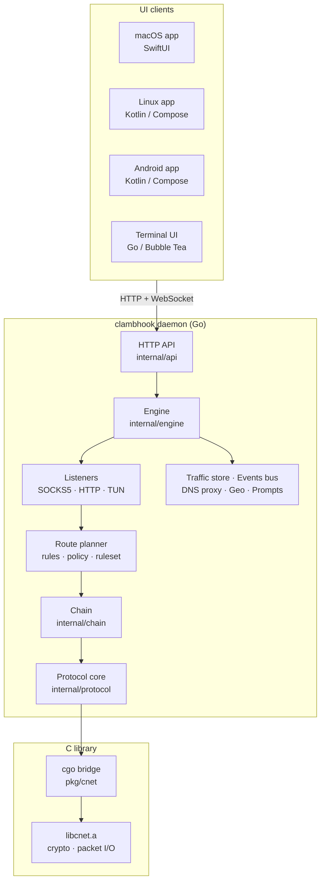
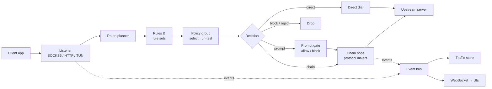
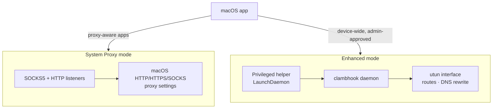
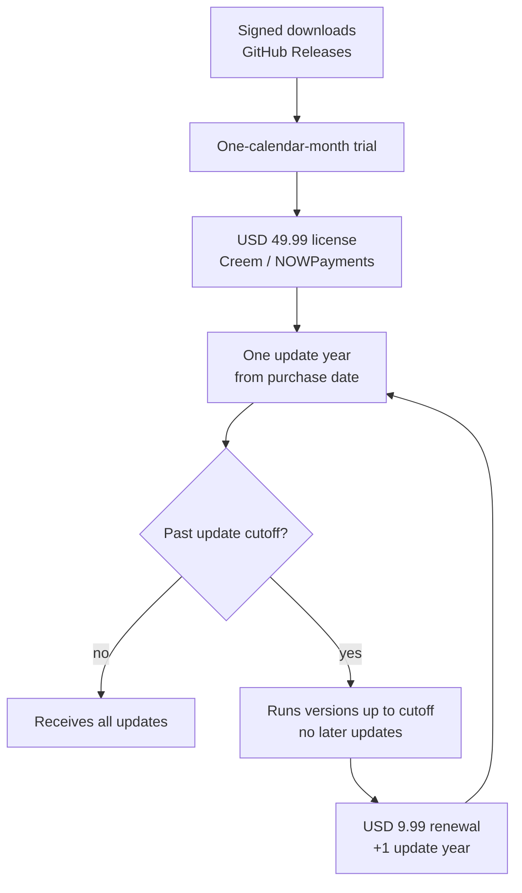
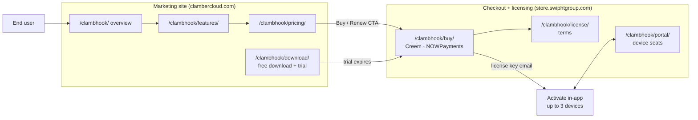

<!-- SPDX-FileCopyrightText: 2026 Pengfan Chang <support@swiphtgroup.com> -->
<!-- SPDX-License-Identifier: GPL-3.0-only -->

<p align="center">
  
</p>

<h1 align="center">Clambhook</h1>

<p align="center">A powerful personalized network tool with local, metadata-first inspection.</p>

---

## Overview

Clambhook is a powerful personalized network tool with local inspection for
routing and connection review. It implements its own protocol core from scratch.
A gated migration is replacing the Go runtime with C17, while the macOS client
remains SwiftUI, Android remains Kotlin/Jetpack Compose, and GNU/Linux moves to
C/GTK 4. See [`docs/c-migration.md`](docs/c-migration.md) for the live cutover
status and compatibility gates.

Activity inspection is metadata-only by default. Opt-in HTTP(S) capture adds a
Proxyman-style debugging surface; HTTPS body capture requires a user-trusted
local certificate authority and is intended only for devices and test traffic
the user controls.

## Architecture

The currently shipping clients still use the legacy daemon while an additive C
runtime is validated against it. Production names and packages switch only
after the parity gates pass.


```mermaid
graph TD
    subgraph clients["UI clients"]
        mac["macOS app<br/>SwiftUI"]
        linux["Linux app<br/>Kotlin / Compose"]
        android["Android app<br/>Kotlin / Compose"]
        tui["Terminal UI<br/>Go / Bubble Tea"]
    end

    subgraph daemon["clambhook daemon (Go)"]
        api["HTTP API<br/>internal/api"]
        engine["Engine<br/>internal/engine"]
        listeners["Listeners<br/>SOCKS5 · HTTP · TUN"]
        router["Route planner<br/>rules · policy · ruleset"]
        chain["Chain<br/>internal/chain"]
        protocols["Protocol core<br/>internal/protocol"]
        support["Traffic store · Events bus<br/>DNS proxy · Geo · Prompts"]
    end

    subgraph native["C library"]
        cnet["cgo bridge<br/>pkg/cnet"]
        clib["libcnet.a<br/>crypto · packet I/O"]
    end

    clients -->|HTTP + WebSocket| api
    api --> engine
    engine --> listeners --> router --> chain --> protocols
    engine --> support
    protocols --> cnet --> clib
```

- **Go** — protocol core, chain orchestration, configuration parsing, listeners,
  the HTTP API, and the terminal UI.
- **C** — performance-critical paths reached through the `pkg/cnet` cgo bridge:
  packet processing, cryptographic operations, and low-level network I/O.
  Requires `libsodium` discoverable through `pkg-config`.

### Connection data flow

Every connection is admitted by a listener, resolved to a chain by the route
planner, then dialed hop by hop through the configured protocols. Lifecycle and
byte-count events flow onto the event bus for the traffic store and live UI
subscribers.


```mermaid
flowchart LR
    app["Client app"] --> listener["Listener<br/>SOCKS5 / HTTP / TUN"]
    listener --> planner["Route planner"]

    planner --> rules["Rules &<br/>rule sets"]
    rules --> policy["Policy group<br/>select · url-test"]
    policy --> decision{Decision}

    decision -->|direct| direct["Direct dial"]
    decision -->|block / reject| drop["Drop"]
    decision -->|prompt| gate["Prompt gate<br/>allow / block"]
    decision -->|chain| chain["Chain hops<br/>protocol dialers"]

    gate --> chain
    chain --> upstream["Upstream server"]
    direct --> upstream

    listener -. events .-> bus["Event bus"]
    chain -. events .-> bus
    bus --> traffic["Traffic store"]
    bus --> ws["WebSocket → UIs"]
```

## Protocols

The protocol core registers dialers through the `internal/protocol` registry
using stable lowercase identifiers. Chains route through one or more hops, and
policy groups select between chains by manual choice or automatic latency
testing (`url-test`).

## Features

- Own protocol core supporting proxy, tunnel, and anonymity protocols.
- ShadowTLS (v3) transport obfuscation that wraps an inner protocol inside a
  genuine TLS 1.3 handshake, used as an entry hop in front of a proxy hop.
- Multi-hop chain proxying with `select` and `url-test` policy groups.
- Metadata-only activity inspection: connection targets, routing decisions, byte
  counts, and hop status.
- Rule-based routing with reusable rule sets, remote rule subscriptions, and
  per-process matchers.
- Little Snitch-style interactive connection prompts for local-proxy traffic.
- Opt-in HTTP(S) capture with body previews, daemon-side body viewers (pretty
  JSON/XML/form/HTML plus a hex dump, shared across every client), server-side
  flow filtering (method, status range, host, scheme, content type, errors, and
  free-text search), HAR export with connect/SSL/send/wait/receive timings,
  repeat and standalone compose/send, cURL import/export, map rules, and
  breakpoints.
- Encrypted DNS (DoH / DoT / DoQ) with local answering in TUN mode, including a
  first-class `controld` upstream so end users can plug in their own Control D
  resolver by id.
- Server geolocation display and emoji support in configuration profiles.

## macOS modes

The macOS app uses daemon-backed routing and does not embed Apple's Network
Extension or System Extension targets.


```mermaid
graph TD
    app["macOS app"]

    subgraph proxy["System Proxy mode"]
        pl["SOCKS5 + HTTP listeners"]
        ps["macOS HTTP/HTTPS/SOCKS<br/>proxy settings"]
        pl --> ps
    end

    subgraph enhanced["Enhanced mode"]
        helper["Privileged helper<br/>LaunchDaemon"]
        daemon["clambhook daemon"]
        utun["utun interface<br/>routes · DNS rewrite"]
        helper --> daemon --> utun
    end

    app -->|proxy-aware apps| proxy
    app -->|device-wide, admin-approved| enhanced
```

- **System Proxy mode** exposes local SOCKS5 and HTTP listeners and optionally
  points macOS proxy settings at them. It covers only apps that honor macOS
  proxy settings.
- **Enhanced mode** runs the privileged daemon with a utun interface for
  device-wide routing, installing routes and temporarily rewriting DNS when
  encrypted DNS is enabled. It requires admin approval for the helper.

See [`docs/macos-v1-scope.md`](docs/macos-v1-scope.md) for the full scope.

## Platforms

| Platform | UI framework | Status |
| --- | --- | --- |
| macOS 14+ (Apple Silicon) | SwiftUI | Public release |
| GNU/Linux (Trisquel, Rocky Linux, AlmaLinux) | C / GTK 4 target with native rule, TOML, and license management; Compose remains only as rollback during parity | Public release |
| Android 12+ | Kotlin / Compose | Public signed APK |

Windows development is discontinued with no planned resumption date.

macOS supports menu bar integration and widgets.

### Terminal UI

Clambhook includes a built-in terminal UI (`bin/clambhook-tui`), tested on Apple
Terminal, PowerShell, GNOME Terminal, Xfce Terminal, and KDE Konsole.

## Building

The legacy build uses `CGO_ENABLED=1`. The replacement C17 build uses CMake,
Ninja, and C dependencies discovered through `pkg-config`; see
[`docs/c-migration.md`](docs/c-migration.md).
The current native data-plane slice wires C SOCKS5 and HTTP proxy listeners to
native TOML and compiled routing rules. Direct routes and TCP-only Trojan,
clambback, Shadowsocks AEAD-2018, ShadowTLS v3 carrier, Tor SOCKS5, and modern
VMESS-AEAD chains, including nested encrypted hops, are operational. Native
VMESS covers raw TCP and TLS with AES-128-GCM or ChaCha20-Poly1305. The native
packet API also covers direct UDP and single-hop Shadowsocks AEAD-2018 UDP;
Trojan/clambback and modern VMESS-AEAD UDP are operational as single or final
stream-carried hops. The SOCKS5 listener exposes those paths through
asynchronous `UDP ASSOCIATE` sessions. Native process-rule attribution now maps
local TCP and UDP source sockets through `libproc` on macOS and `/proc` on
GNU/Linux; the listener skips that platform scan when no compiled rule uses a
process matcher. The native runtime also observes macOS interface/SSID and
GNU/Linux interface changes, reports them in status, and atomically selects the
first matching profile trigger with listener rollback on failure. WireGuard,
OpenVPN, DoQ, and platform VPN lifecycle stay guarded until
their parity tests pass. A pinned lwIP 2.2.1 C core now
provides the shared IPv4/IPv6 packet foundation on host platforms and all four
Android NDK ABIs. Native runtime/JNI lifecycle, configured MTU/CIDRs, ICMP
checksums, packet injection, and Kotlin callback output are covered. Bounded
IPv4/IPv6 TCP and UDP flows now route through native direct or encrypted
transports with tuple/checksum restoration, TCP backpressure, UDP session
reuse, encrypted-DNS port-53 interception, and TTL-bounded A/AAAA domain
recovery for rule matching. A bounded pre-routing reassembler rejects fragment
overlaps, expires incomplete IPv4/IPv6 datagrams, and supports common IPv6
option/routing/authentication extension chains. Android native transport
linkage now resolves direct, named-chain, and policy-group decisions through
the shared C protocol layer for TCP and UDP. Android builds pin and checksum
OpenSSL 3.5.8 LTS from its official source archive, statically link it for all
four packaged ABIs at the Android 12/API 31 floor, and package its Apache 2.0
license alongside ClambHook's component licenses. A physical Pixel 3a XL/API
32 has passed the JNI/Compose suite, including on-device AES-128-GCM,
AES-256-GCM, and ChaCha20-Poly1305 self-tests and delayed direct UDP; physical
hardware is optional and does not replace the API 31/33/36 managed-device
matrix. Android's production VPN service selects the native C/JNI runtime.
Its packet path now owns DoH/DoT interception and returns a correlated SERVFAIL
when every encrypted upstream fails. The NDK build pins a checksum-verified,
HTTP(S)-only curl 8.18.0 library for DoH and uses Android's system CA store. The
shared native DNS library provides route-planned DoH and DoT, Control D
expansion/bootstrap hygiene, response correlation validation, upstream
failover, and SERVFAIL generation; it deliberately rejects DoQ rather than
downgrading it. Runtime lifecycle/profile rollback now owns that proxy and
routes upstream streams through the same native rules and chains as listener
traffic. Native profile-scoped control reads now decode `?profile=` strictly,
return 404 for unknown profiles instead of silently falling back, expose the
route-explanation alias, and persist active-profile mutations with validated
TOML replacement, atomic backups, live transactional reload, and disk rollback
when the new profile cannot start. Other persistent control edits remain
gated. Native DNS, listener/TUN/DNS/prompt settings, and conditioner updates
now use a shared typed configuration tree and complete semantic TOML renderer.
File-backed updates retain an atomic backup, apply to the live runtime
transactionally, restore both disk and service state when apply fails, and
preserve the runtime's current active profile across network-triggered
switches. Ordered rule replacement and append-only creation, policy-group
replacement, rule-set replacement, and rule-subscription replacement use the
same transaction and return the Go-compatible profile/collection/backup
envelopes. Manual `select` policy-group changes are also persisted
transactionally; policy-group reads expose the config-derived Go snapshot
shape with normalized defaults, selected chain, selection mode/reason, and
live health-probe results. The native policy manager actively evaluates every
group type, and `POST /api/v1/policy-groups/test` refreshes one named group or
all groups in the running engine. Native config
export/import now round-trips validated TOML with a 4 MiB
transfer limit, attachment metadata, atomic backup, transactional live reload,
and disk rollback on apply failure. Config-derived GET coverage now also
includes DNS, listener/TUN/DNS/prompt settings, conditioner state, and rule
subscription base status with strict profile selection. Developer settings
reads and transactional writes now apply Go-compatible defaults, enforce the
explicit HTTPS-capture acknowledgement, normalize redaction/host lists, and
never expose CA key or certificate paths. The C proxy now captures opt-in
plain-HTTP request and response traffic with bounded bodies, redaction,
filtered entry/detail reads, cURL export, HAR 1.2 export, and clearing. HTTPS
MITM, CA management, replay, standalone send, and developer-rule
execution remain gated. Developer map, breakpoint, and rewrite rule reads,
ordered replacement, and ID deletion now persist through the same transaction;
responses retain the public `ops` wire name while TOML uses `op`. These rules
are configuration-only until the native developer engine executes them. Rule
cleanup/from-connection creation and DNS upstream route annotations remain
gated. A bounded, non-executing C cURL importer is shared by the daemon API
and Android JNI runtime. The C rule-feed subsystem now parses `auto`, `plain`,
`hosts`, and
`adblock` sources with the frozen 5 MiB and 200,000-entry limits, reads and
writes the version-1 Go cache format, enriches rule-set/subscription status,
and appends cached subscription rules after manual rules in the live route
engine. The native daemon owns both refresh endpoints with conditional HTTP,
atomic cache replacement, public-address validation, DNS pinning against
rebinding, same-origin redirect checks, and per-feed error reporting that
retains the previous cache. Android
exercises the same requested-profile contract over JNI and keeps its app-owned
active-profile switch in memory, matching the current mobile lifecycle
contract.
Building, running, testing, modifying, and redistributing the application core
are permitted under GPL-3.0-only. The reusable crypto libraries in `clib` and
`pkg/cnet` are Apache-2.0. See [`LICENSING.md`](LICENSING.md) for the exact
component boundary and the separate commercial-license path.

| Command | Result |
| --- | --- |
| `make build` | Builds `clib/libcnet.a`, then both Go binaries into `bin/`. |
| `make build-daemon` | Builds only `bin/clambhook`. |
| `make build-tui` | Builds only `bin/clambhook-tui`. |
| `make test` | Builds `clib/libcnet.a`, then runs `go test ./...`. |
| `make build-native` | Builds the additive C17 runtime, daemon, helper, and native tests. |
| `make test-native` | Runs sanitizer-backed C tests and license differential parity. |
| `make build-linux-gtk` | Builds the additive C/GTK 4 GNU/Linux client and runs its model/executable tests. The distro lanes also launch the GUI under Xvfb. |
| `make build-android-native` | Builds the C/JNI runtime for the Android NDK ABIs. |
| `make test-android-compatibility` | Runs Compose instrumentation on managed API 31/33/36 devices. |
| `make lint` | Runs `go vet ./...` (and `staticcheck` when installed). |
| `make clean` | Removes `bin/` and build artifacts. |

A configuration template lives at [`configs/example.toml`](configs/example.toml).
See the [Repository layout](#repository-layout) section below and the
[`docs/`](docs/) directory for repository structure and conventions.

## CI/CD and testing

GitHub Actions is the primary CI orchestrator. [`.github/workflows/ci.yml`](.github/workflows/ci.yml)
runs source/workflow policy checks, native C sanitizers and macOS portability,
Android unit/lint/build gates, Compose/JNI instrumentation on API 31/33/36, and
the only supported GNU/Linux test matrix: Trisquel 12, Rocky Linux 9, and
AlmaLinux 9. [`.github/workflows/security.yml`](.github/workflows/security.yml)
runs CodeQL and pull-request dependency review; Dependabot covers Actions, Go,
Gradle, and Swift dependencies. All third-party actions are pinned to immutable
commit SHAs and workflow permissions default to none.

[`.github/workflows/release.yml`](.github/workflows/release.yml) provides the
protected CD path for signed tags and approved manual beta/recovery runs. It
signs/notarizes on protected runners and publishes checksummed, signed assets
directly to GitHub Releases; short-lived Actions artifacts are not used for
installer distribution.
See [`docs/github-cicd.md`](docs/github-cicd.md) for environment protection,
required secrets, release behavior, and branch-protection setup.

The optional local GNU/Linux mirror uses Podman or Docker; GitHub Actions is the
authoritative cross-distro lane:

```sh
scripts/validate-linux-distros.sh            # Trisquel 12 + Rocky Linux 9 + AlmaLinux 9
```

`scripts/ci-local.sh` runs the corresponding local gate across all platforms in sections
(`go`, `apple`, `android`, `linux`, `e2e`, `smoke`; default `all`), skipping any
section whose tooling is absent. The macOS app is built and tested locally, not
in the ordinary GitHub CI workflow, with
`make build-apple` and `make test-apple` (`swift test`); Android with
`make test-android`, `make lint-android`, and `make build-android` (plus an on-device AVD smoke when `CI_LOCAL_ANDROID_AVD=<name>` is set); the Go core
with `make test`, `make test-race`, and `make lint`. See
[`docs/release-validation.md`](docs/release-validation.md) for the full policy
and [`packaging/README.md`](packaging/README.md) for the container harness.

## Android development

Google's [`android`](https://developer.android.com/cli) CLI is the default tool
for Android development: SDK/NDK provisioning, emulator management, and
build-deploy-launch on a device or Android SDK Emulator (AVD) (`android run`, or `make run-android`).
Gradle is still used for unit tests (`make test-android`), lint
(`make lint-android`), and release assembly (`make build-android-release`)
because the `android` CLI has no equivalent commands. Gradle packages the
NDK-built C/JNI library and its pinned OpenSSL runtime; no gomobile AAR is
packaged or selected by the production VPN service. See
[`docs/android-development.md`](docs/android-development.md) for the full guide.

## Repository layout

| Path | Contents |
| --- | --- |
| `cmd/clambhook`, `cmd/clambhook-tui` | Legacy daemon and terminal-UI parity oracles. |
| `native/src/daemon`, `native/src/tui` | Native C17 daemon and terminal client used for cutover validation. |
| `internal/` | Core: protocols, chain, config, listeners, API, engine, geo. |
| `pkg/cnet`, `pkg/mobile` | cgo bridge and mobile embedding surface. |
| `clib/` | C static library (`src/`, `include/`). |
| `native/` | C17 runtime ABI, daemon, JNI bridge, helper, and native tests. |
| `ui/apple`, `ui/linux`, `ui/linux-gtk`, `ui/android` | Platform client apps and migration targets. |
| `docs/` | Scope, roadmap, distribution, and release documentation. |
| `configs/` | Example configuration. |

## Distribution and licensing

The end-user apps are distributed from the official
[GitHub Releases page](https://github.com/JohnThre/clambhook/releases). Releases
include a notarized DMG for Apple Silicon Macs running macOS 14 or later,
signed `.deb` and `.rpm` packages tested on Trisquel, Rocky Linux, and
AlmaLinux, and a signed Android APK for Android 12/API 31 or later. First launch
starts a one-calendar-month trial, after which a USD 49.99 one-time ClambHook license is
purchased from `https://store.swiphtgroup.com/clambhook/buy`.

The license includes one year of all updates from the purchase date; versions released
on or before the update cutoff remain usable after the cutoff. It covers a maximum of 3 concurrently active
devices across supported platforms, and seats can be deactivated for transfers. After the
cutoff, no later updates are included, including critical, bug, and security updates. A USD 9.99
renewal buys one additional update year, extending from the later of the current cutoff or the
renewal payment date. Purchase payments are accepted only through Creem or NOWPayments, not PayPal.


```mermaid
flowchart TD
    download["Signed downloads<br/>GitHub Releases"] --> trial["One-calendar-month trial"]
    trial --> buy["USD 49.99 license<br/>Creem / NOWPayments"]
    buy --> year["One update year<br/>from purchase date"]
    year --> cutoff{Past update cutoff?}
    cutoff -->|no| updates["Receives all updates"]
    cutoff -->|yes| frozen["Runs versions up to cutoff<br/>no later updates"]
    frozen --> renew["USD 9.99 renewal<br/>+1 update year"]
    renew --> year
```

### Web presence and commerce separation

ClambHook's public web presence is split across two independently deployed
sites, each with a single responsibility. All landing and marketing pages —
overview, features, pricing, download, privacy, and support — live on
**Clamber Cloud** (`clambercloud.com`). Every purchase, subscription, renewal,
and license-device action happens on the **Swipht Group store**
(`store.swiphtgroup.com`). Marketing pages never process payments; they deep-link
purchase calls-to-action to the store. This keeps the download/trial surface and
the payment/licensing surface cleanly isolated.


```mermaid
flowchart LR
    subgraph marketing["Marketing site (clambercloud.com)"]
        overview["/clambhook/ overview"]
        features["/clambhook/features/"]
        pricing["/clambhook/pricing/"]
        dl["/clambhook/download/<br/>free download + trial"]
    end

    subgraph store["Checkout + licensing (store.swiphtgroup.com)"]
        buy["/clambhook/buy/<br/>Creem · NOWPayments"]
        license["/clambhook/license/<br/>terms"]
        portal["/clambhook/portal/<br/>device seats"]
    end

    user["End user"] --> overview
    overview --> features --> pricing
    pricing -->|"Buy / Renew CTA"| buy
    dl -->|"trial expires"| buy
    buy -->|"license key email"| activate["Activate in-app<br/>up to 3 devices"]
    activate <--> portal
    buy --> license
```

- **Marketing (`clambercloud.com`):** product content, feature, pricing, and
  download guidance linking to official GitHub Release assets. No checkout
  runs here; purchase CTAs continue to link to the store.
- **Checkout / licensing (`store.swiphtgroup.com`):** Creem and NOWPayments
  checkout, license-key delivery, update-year renewals, and the device-seat
  portal enforcing the 3 concurrently active device limit.

Official public routes:

- Product: `https://store.clambercloud.com/clambhook/`
- Download: `https://github.com/JohnThre/clambhook/releases`
- Features: `https://store.clambercloud.com/clambhook/features/`
- Pricing: `https://store.clambercloud.com/clambhook/pricing/`
- Buy or upgrade: `https://store.swiphtgroup.com/clambhook/buy/`
- License portal: `https://store.swiphtgroup.com/clambhook/portal/`
- License terms: `https://store.swiphtgroup.com/clambhook/license/`
- Privacy policy: `https://store.clambercloud.com/clambhook/privacy/`
- Support: `https://store.clambercloud.com/clambhook/support/`

ClambHook is distributed to end users through GitHub Releases, not app
marketplaces, Homebrew, package registries, Cloudflare R2, or third-party
mirrors. macOS, GNU/Linux, and Android 12+ are public release targets. Windows
development is discontinued with no planned resumption date. See
[`docs/distribution.md`](docs/distribution.md) and
[`docs/license-validation.md`](docs/license-validation.md).

GitHub is the source, CI, and official signed binary distribution host.
GPL-compliant forks may build and redistribute the public
application core under their own branding and must not imply official status.

## License

Copyright 2026 Pengfan Chang. The ClambHook application core is available under
GPL-3.0-only or under separate written commercial terms. `clib/**` and
`pkg/cnet/**` are Apache-2.0. Third-party material retains its upstream terms.
See [`LICENSING.md`](LICENSING.md), [`NOTICE`](NOTICE), and
[`CONTRIBUTING.md`](CONTRIBUTING.md).

## Author

Pengfan Chang — <support@swiphtgroup.com>

## Donate

Support ClambHook development through any of these services:

- [Ko-fi](https://ko-fi.com/jpfchang)
- [Liberapay](https://en.liberapay.com/jpfchang/)
- [IssueHunt](https://oss.issuehunt.io/u/johnthre)
- [NOWPayments cryptocurrency donation](https://nowpayments.io/donation?api_key=5792a927-dd7d-4b0c-982b-584a7499ffc9)

<a href="https://nowpayments.io/donation?api_key=5792a927-dd7d-4b0c-982b-584a7499ffc9" target="_blank" rel="noreferrer noopener">
    
</a>
