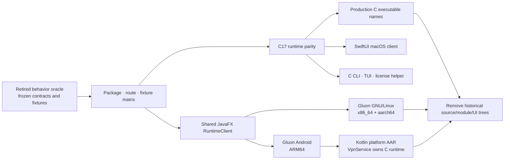

<!-- SPDX-FileCopyrightText: 2026 Pengfan Chang <support@swiphtgroup.com> -->
<!-- SPDX-License-Identifier: GPL-3.0-only -->

# Completed C17 and JavaFX/Gluon Cutover

This is the permanent cutover record. It intentionally names the retired Go,
gomobile, Compose, and GTK implementations as historical artifacts; they are
not build options, rollback paths, or active instructions.

## Outcome

The production runtime, daemon, terminal UI, license helper, protocol engine,
packet stack, API server, persistence, and platform bridges are C17. The
production executable names are:

- `clambhook`
- `clambhook-tui`
- `clambhook-license`

Android and GNU/Linux use the same JavaFX 21.0.12 application and typed
asynchronous `RuntimeClient`. Platform-only behavior is isolated behind
`PlatformServices`. GluonFX 1.0.29 produces Android AArch64 packages and
self-contained GNU/Linux x86_64/aarch64 native images. Java 17 is the source
and toolchain floor.

The Android Kotlin code is a platform AAR only. It owns `VpnService`, TUN and
foreground-service lifecycle, consent, per-application routing, secure storage,
QR/file activities, notifications, licensing, and updater integration. Its
service owns one C runtime independently of the JavaFX activity lifecycle.

The macOS 14+ Apple Silicon SwiftUI client remains native and embeds only the
C17 daemon/TUI and required native libraries.



## Frozen contracts preserved

- CLI option names, output shapes, exit behavior, executable names, and
  environment overrides.
- TOML schema/defaults, profile inheritance and triggers, mutation validation,
  backup naming, atomic persistence, and rollback.
- JSON fields, status/error envelopes, authenticated loopback HTTP routes, and
  WebSocket event framing/filtering/reconnect semantics.
- License command JSON, trial/update-cutoff/device-seat behavior, snapshot
  persistence, and product identifiers.
- Traffic metadata, rule/policy decisions, prompt and temporary-rule
  lifecycles, capture data, and developer-tool routes.
- Application IDs, macOS bundle/keychain groups, Android minSdk 31 and
  targetSdk 36, and release/update manifest fields.

## Runtime parity

The C17 implementation covers:

- SOCKS5, HTTP, HTTPS capture, TUN, IPv4/IPv6, TCP/UDP, fragmentation,
  connection attribution, network watching, DNS, policy, prompts, rule feeds,
  traffic/events, configuration, licensing, and developer tooling.
- WireGuard keys, peers, allowed IPs, DNS, keepalive, MTU, TCP/UDP routed
  traffic, replay rejection, rekey, and lifecycle.
- OpenVPN 2.6+ UDP, TLS 1.2+, key-method 2/TLS-EKM, AES-256-GCM,
  ChaCha20-Poly1305, PKI, and optional username/password. Unsupported TCP,
  CBC, compression, and legacy control modes fail closed.
- VMESS-AEAD, ShadowTLS v3, Shadowsocks AEAD-2018, Tor SOCKS5 isolation,
  direct routing, nested chains, and policy-group selection.
- DoH, DoT, DoQ, Control D identifiers, local TUN DNS answering, rule-set and
  subscription refresh, MMDB geo lookup, capture CA lifecycle, map/rewrite
  rules, breakpoints, cURL import, request send/repeat, and HAR data.

## UI cutover

The shared JavaFX view covers dashboard status; profiles and configuration
transfer; activity, traffic, and decisions; servers/chains; rules, temporary
rules, rule sets, subscriptions, and policy groups; DNS, firewall/TUN,
conditioner, prompts, developer capture/CA/map/rewrite/breakpoints; settings,
licensing, and updates.

The UI has responsive side/bottom navigation, keyboard accelerators, named
accessible controls, focus-safe background updates, explicit failure/retry
state, and no blocking control calls on the JavaFX application thread.

## Build and release cutover

- CMake/Ninja is the production runtime build and CTest is the native test
  runner. First-party C warnings are errors.
- Maven owns JavaFX compile/test/JaCoCo and Gluon builds. Gradle owns only the
  Kotlin Android platform AAR.
- A checksum-pinned standalone actionlint 1.7.12 binary validates workflows.
- Dependabot covers Actions, Maven, and Android Gradle dependencies.
- CodeQL covers C/C++, Java/Kotlin, and Swift.
- GNU/Linux CI runs only Ubuntu 24.04 LTS and Fedora Linux 44 on x86_64 and
  aarch64. Ubuntu produces Debian packages and Fedora produces RPMs.
- Android managed-device lanes use `aosp_atd/x86_64` on Ubuntu/KVM for API 31,
  33, and 36. The test-only JNI slice does not change the ARM64-only product
  artifacts. Physical devices are supplemental; API 30 is not supported.
- Protected release jobs build, inspect, sign, and checksum GNU/Linux packages,
  Android APK/AAB files, and the notarized macOS DMG. Ordinary CI publishes no
  installer artifacts.

## Removed historical artifacts

After the contract, platform, packaging, and verification gates passed, the
repository removed all tracked `*.go` files, `go.mod`, `go.sum`, `vendor/`,
gomobile/cgo bindings, the former command/package trees, Go-only end-to-end
tools, the Compose Android/Desktop clients, the GTK prototype, and the Skip
prototype. Reusable C code remains in `clib/`, `native/`, and `third_party/`.

## Required verification

The cutover gate is represented by these commands and hosted lanes:

```sh
make test-native
make test-javafx
make test-android
make build-apple
make test-apple
scripts/validate-linux-distros.sh
scripts/check-cutover.sh
scripts/check-license-policy.sh
scripts/check-github-actions.sh
make package-smoke
```

Final delivery additionally requires a staged whitespace check, source-only and
secret/artifact review, clean package payload inspection, clean worktree,
non-force push to `origin/master`, green required workflows, and equality of
local `HEAD`, `origin/master`, and `git ls-remote`.
