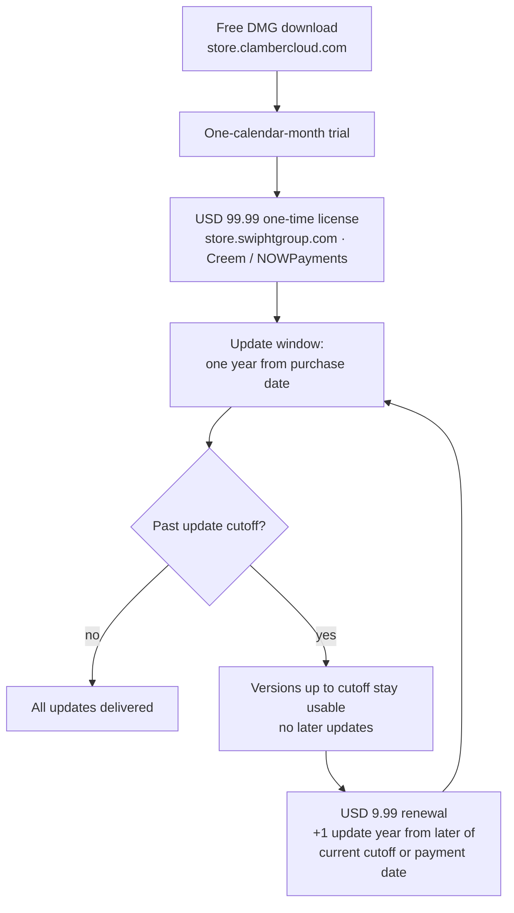

# Distribution Policy

ClambHook end-user downloads are distributed only from
`store.clambercloud.com`. Checkout, license delivery, device-seat management,
and update-year renewals are handled by `store.swiphtgroup.com`.

## End-user Downloads

- Official product page: `https://store.clambercloud.com/clambhook/`.
- Download page: `https://store.clambercloud.com/clambhook/download/`.
- Buy or upgrade page: `https://store.swiphtgroup.com/clambhook/buy/`.
- License portal: `https://store.swiphtgroup.com/clambhook/portal/`.
- The public macOS DMG download is free and supports Apple Silicon Macs running macOS 14.0 or later.
- The public GNU/Linux download is free and ships as `.deb`, `.rpm`, Flatpak, and AppImage packages tested on Bazzite, Rocky Linux, PureOS, Ubuntu, Debian, and Fedora.
- The first launch starts a one-calendar-month trial.
- A USD 99.99 one-time ClambHook license is required after the trial and includes one year of all updates from the purchase date.
- Versions released on or before the update cutoff remain usable after the cutoff.
- Each license covers a maximum of 10 concurrently active devices across supported platforms.
- Device seats can be deactivated so the license can be moved to another device.
- After the cutoff, no later updates are included, including critical, bug, and security updates.
- A USD 9.99 renewal buys one additional update year, extending from the later of the current cutoff or the renewal payment date.
- ClambHook purchase payments are accepted only through Creem or NOWPayments, not PayPal.
- GitHub is source-only and view-only for end users.

The source is proprietary to Pengfan Chang, all rights reserved, and may not be
copied, modified, built, run, contributed to, redistributed, packaged, released,
hosted, sublicensed, or used to create derivative works without separate prior
written permission from Pengfan Chang.

## License Products

| Display name | Product ID | Type | US base price |
| --- | --- | --- | --- |
| ClambHook License | `org.jpfchang.clambhook.unlock.lifetime` | Direct-sale license | USD 99.99 |
| ClambHook Update Year | `org.jpfchang.clambhook.feature_update` | Direct-sale update-year renewal | USD 9.99 |

A single provider-neutral renewal SKU applies to each additional update year;
there is no per-year product identifier.

The ClambHook license includes all updates released through the purchase date
plus one year. Versions released on or before that cutoff remain usable after
the update window ends. Each USD 9.99 renewal extends the update window by one
additional year from the later of the current cutoff or the renewal payment
date. Releases after the cutoff are not included, including critical, bug, and
security updates.

## GitHub Release Rule

Do not release end-user installers or package artifacts on GitHub. This includes
`.dmg`, `.pkg`, `.apk`, `.aab`, Homebrew formula releases, Debian packages, and
macOS installer artifacts.

macOS and GNU/Linux ship as public downloads from `store.clambercloud.com`.
GNU/Linux packages (`.deb`, `.rpm`, Flatpak, AppImage) are still never published
as GitHub release artifacts. Android build, package, and release targets remain
Pengfan Chang's internal developer QA until a supported public download channel
is configured under `store.clambercloud.com`. Windows development is discontinued
with no planned resumption date.

## CI Validation Before Release

Every installer is validated in CI before manual QA, signing, or upload to an
approved channel — never on GitHub Releases:

- Apple platforms (macOS, iOS, iPadOS, watchOS, visionOS) are validated on
  **Xcode Cloud** first (`ci_scripts/ci_post_clone.sh`).
- GNU/Linux, Windows, and Android are validated on **GitHub Actions** first
  (`.github/workflows/installer-validation.yml`), which builds and smoke-tests
  only and uploads no artifacts.

See [`release-validation.md`](release-validation.md) for the full policy and
diagrams.

## macOS Scope

macOS uses daemon-backed routing. System Proxy mode may launch the bundled
daemon through the approved privileged helper or the user-session fallback,
expose local SOCKS5 and HTTP listeners, and optionally configure macOS system
HTTP, HTTPS, and SOCKS proxy settings to use those listeners. Traffic status and
history in System Proxy mode apply only to traffic that reaches the configured
clambhook proxy listeners.

Enhanced Mode launches the daemon through the privileged helper, creates a utun
interface, installs routes, and temporarily rewrites DNS when encrypted DNS is
enabled. It is the device-wide routing path for direct website builds and does
not use Apple's Network Extension or System Extension capabilities.

The full scope note is in `docs/macos-v1-scope.md`.
