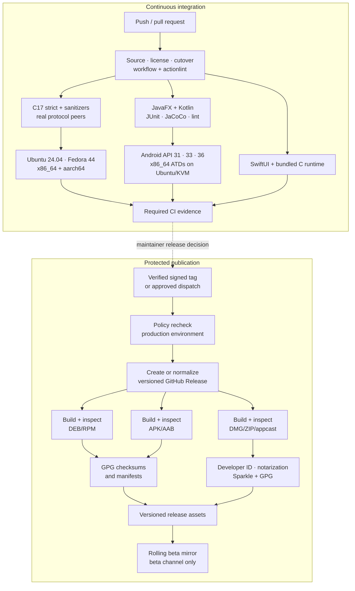

<!-- SPDX-FileCopyrightText: 2026 Pengfan Chang <support@swiphtgroup.com> -->
<!-- SPDX-License-Identifier: GPL-3.0-only -->

# GitHub CI/CD

GitHub Actions is the authoritative automation and GitHub Releases is the only
official binary distribution channel when a protected publication succeeds.
Workflows default to no permissions, pin every third-party action to a full
commit SHA, and grant job-scoped access.

## Continuous integration

`.github/workflows/ci.yml` runs:

- source-only, SPDX/component-license, cutover, workflow, and shell policy;
- checksum-pinned standalone actionlint 1.7.12
  (`8aca8db96f1b94770f1b0d72b6dddcb1ebb8123cb3712530b08cc387b349a3d8`
  for Linux x86_64);
- strict C17 builds, ASan/UBSan, CTest, license/CLI/TUI contracts, protocol
  tamper/replay/rekey fixtures, configuration rollback, API, and WebSocket tests;
- JavaFX Maven/JUnit/JaCoCo verification and Kotlin AAR tests/lint;
- unsigned SwiftUI macOS build/test with the C runtime;
- Ubuntu 24.04 LTS and Fedora Linux 44 on x86_64 and aarch64 runners,
  including Gluon native image launch plus package install, integration, and
  uninstall checks;
- Gluon Android ARM64 build and `aosp_atd/x86_64` managed-device journeys on
  API 31, 33, and 36. Device journeys use Ubuntu 24.04 x86_64 hosted runners
  with KVM and a debug-only x86_64 JNI slice; APK/AAB output remains
  ARM64-only. Ubuntu and Fedora remain the complete GNU/Linux
  application/package matrix.

`.github/workflows/security.yml` runs C/C++, Java/Kotlin, and Swift CodeQL plus
dependency review. Dependabot covers Actions, Maven, and Android Gradle
dependencies.

Ordinary workflows may upload logs, test reports, and coverage. They must not
upload installers or package outputs.

## Release workflow

`.github/workflows/release.yml` is protected by the `production` environment.
It accepts either a verified signed stable tag or an approved manual request.
It builds and signs:

- Debian packages from Ubuntu on x86_64 and aarch64;
- RPM packages from Fedora on x86_64 and aarch64;
- ARM64 Android APK/AAB files with the protected Android keystore;
- the Apple Silicon SwiftUI app, embedded C runtime, notarized DMG, and Sparkle
  appcast;
- manifests, SHA-256 files, and GPG signatures.

Ubuntu and Fedora are the complete GNU/Linux validation matrix. No additional
distribution is treated as a release or compatibility authority.



## Local workflow checks

```sh
scripts/check-github-actions.sh
scripts/check-license-policy.sh
scripts/check-cutover.sh
shellcheck -x scripts/*.sh
```

The hosted policy job downloads actionlint from its versioned GitHub Release,
verifies the pinned archive SHA-256, extracts only the binary, and runs it
without a language package manager.

## Delivery policy

- Never force-push a release or cutover commit.
- Never create a tag merely to validate a build.
- Never expose signing secrets in files, logs, caches, or artifacts.
- Never replace the API 31 floor with API 30.
- Never use Apple’s `container` CLI for hosted or local authority.
- Never describe a source version, tag, or successful CI run as a published
  release; verify the versioned release and its assets independently.
- Finish a source delivery only when required checks are green, the worktree is
  clean, and local `HEAD`, `origin/master`, and `git ls-remote` agree.
