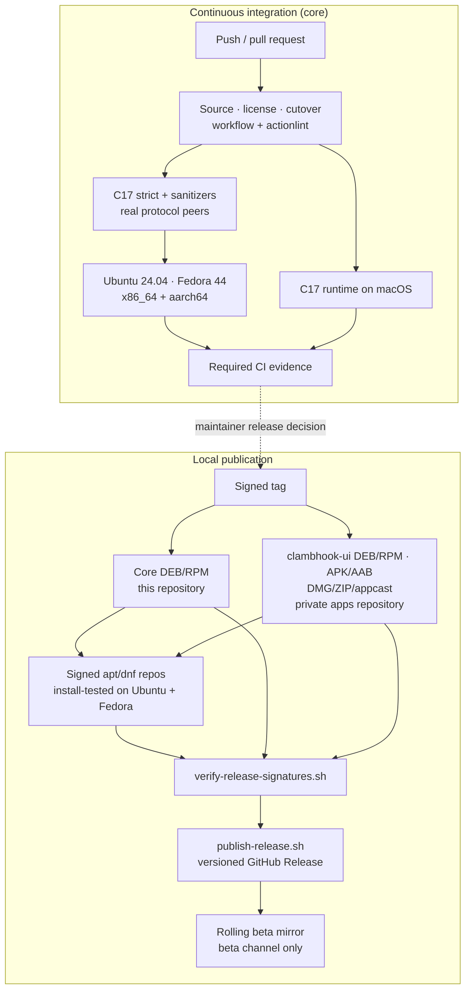

<!-- SPDX-FileCopyrightText: 2026 Pengfan Chang <support@swiphtgroup.com> -->
<!-- SPDX-License-Identifier: GPL-3.0-only -->

# GitHub CI/CD

GitHub Actions builds and tests the GPL-3.0-only core. GitHub Releases is the
only official binary distribution channel. Releases are built, signed, and
published from the maintainer's machine; no workflow builds, signs, or uploads
installers, and no workflow holds release credentials. Workflows default to no
permissions, pin every third-party action to a full commit SHA, and grant
job-scoped access.

The proprietary apps (SwiftUI, Kotlin/Compose, TUI) have their own build-and-test
CI in the private apps repository.

## Continuous integration

`.github/workflows/ci.yml` runs:

- source-only, SPDX/component-license, cutover, workflow, and shell policy;
- checksum-pinned standalone actionlint 1.7.12
  (`8aca8db96f1b94770f1b0d72b6dddcb1ebb8123cb3712530b08cc387b349a3d8`
  for Linux x86_64);
- strict C17 builds, ASan/UBSan, CTest, license/CLI contracts, protocol
  tamper/replay/rekey fixtures, configuration rollback, API, and WebSocket tests;
- the C17 runtime test suite on macOS;
- Ubuntu 24.04 LTS and Fedora Linux 44 on x86_64 and aarch64 runners,
  including core package install, daemon, and uninstall checks.

`.github/workflows/security.yml` runs C/C++ CodeQL plus dependency review.
Dependabot covers GitHub Actions.

Workflows may upload logs, test reports, and coverage. They must not reference
installers, package outputs, `dist/`, release uploads, or signing secrets;
`scripts/check-github-actions.sh` enforces this and rejects a returning
`release.yml`.

## Local release

The maintainer builds a release on their own machine:

1. Sign the release tag with `scripts/sign-release-tag.sh`.
2. In this repository, build and sign the core Debian and RPM packages for
   x86_64 and aarch64 in Ubuntu 24.04 and Fedora 44 containers
   (`scripts/release-linux.sh` through `scripts/validate-linux-distros.sh` with
   `CLAMBHOOK_LINUX_RELEASE_BUILD=1`).
3. In the private apps repository, build and sign the `clambhook-ui` packages,
   the ARM64 Android APK/AAB, and the notarized Apple Silicon DMG/ZIP with its
   Sparkle appcast.
4. Build the signed apt and dnf repositories from both sets of packages
   (`scripts/build-linux-repos.sh`) and install-test them
   (`scripts/test-linux-repo-install.sh`).
5. Run `scripts/publish-release.sh VERSION` (a dry run). It verifies the signed
   tag against the pinned key, then runs `scripts/verify-release-signatures.sh`
   over every asset in both repositories' `dist/` trees.
6. Run `scripts/publish-release.sh --publish VERSION` (or `--publish --beta`).
   It creates the GitHub Release and uploads the assets; beta releases are also
   mirrored to the rolling `beta` release.

Every installer, checksum, manifest, and repository index is signed with the
developer@jpfchang.org key: embedded `rpmsign`/`debsigs` signatures for
packages, and detached `.sig` files for everything. See
[release signing](website-release/signing.md).

Ubuntu and Fedora are the only supported GNU/Linux distributions and the
complete validation matrix.


```mermaid
flowchart TB
    subgraph ci["Continuous integration (core)"]
        push["Push / pull request"] --> policy["Source · license · cutover<br/>workflow + actionlint"]
        policy --> c["C17 strict + sanitizers<br/>real protocol peers"]
        policy --> mac["C17 runtime on macOS"]
        c --> distro["Ubuntu 24.04 · Fedora 44<br/>x86_64 + aarch64"]
        distro --> checks["Required CI evidence"]
        mac --> checks
    end

    subgraph publication["Local publication"]
        tag["Signed tag"] --> core["Core DEB/RPM<br/>this repository"]
        tag --> apps["clambhook-ui DEB/RPM · APK/AAB<br/>DMG/ZIP/appcast<br/>private apps repository"]
        core --> repo["Signed apt/dnf repos<br/>install-tested on Ubuntu + Fedora"]
        apps --> repo
        repo --> verify["verify-release-signatures.sh"]
        core --> verify
        apps --> verify
        verify --> publish["publish-release.sh<br/>versioned GitHub Release"]
        publish --> beta["Rolling beta mirror<br/>beta channel only"]
    end

    checks -. maintainer release decision .-> tag
```

## Local workflow checks

```sh
scripts/check-github-actions.sh
scripts/check-license-policy.sh
scripts/check-cutover.sh
shellcheck -x scripts/*.sh
```

The hosted policy job downloads actionlint from its versioned GitHub Release,
verifies the pinned archive SHA-256, extracts only the binary, and runs it
without a language package manager.

## Delivery policy

- Never force-push a release or cutover commit.
- Never create a tag merely to validate a build.
- Never put signing secrets in files, logs, caches, artifacts, or workflows.
- Never upload an asset that `scripts/verify-release-signatures.sh` has not
  verified; use `scripts/publish-release.sh`.
- Never use Apple’s `container` CLI for hosted or local authority.
- Never describe a source version, tag, or successful CI run as a published
  release; verify the versioned release and its assets independently.
- Finish a source delivery only when required checks are green, the worktree is
  clean, and local `HEAD`, `origin/master`, and `git ls-remote` agree.
