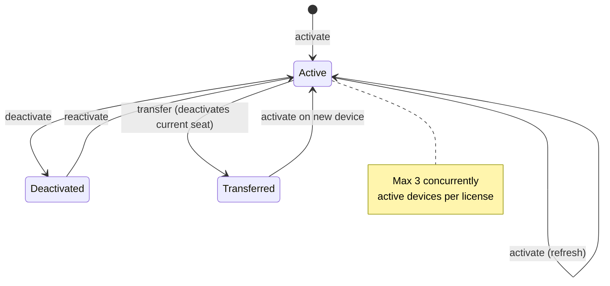

# License Validation

ClambHook uses the hosted `store.swiphtgroup.com` license backend for trial,
activation, device-seat, and update-year-renewal state. Public downloads and
update manifests are served from `store.clambercloud.com`.

## Production Backend

The production license backend is hosted under:

`https://store.swiphtgroup.com/clambhook/license/v1/devices`

This repository does not contain the hosted license server. Backend deployment,
persistent storage, backups, rate limiting, payment webhooks, email delivery,
monitoring, and log redaction are maintained in the `swiphtgroup.com` store
infrastructure.

The application stores and transmits stable identifiers only through the hosted
license flow. The backend stores hashed license keys, checkout records, license
transactions, entitlement windows, generated install IDs, device display names,
platform and architecture values, app version values, activation state, and
transfer/deactivation events needed to support the direct-sale license. Profile
contents, traffic data, proxy credentials, and private keys are not uploaded for
license activation.

## Endpoints

- `POST /clambhook/license/v1/devices/activate` activates or refreshes a licensed device.
- `POST /clambhook/license/v1/devices/deactivate` deactivates a device seat before transfer or retirement.
- `POST /clambhook/license/v1/devices/reactivate` reactivates a known device when policy allows it.
- `POST /clambhook/license/v1/devices/transfer` records a transfer by deactivating the current device seat.
- Compatibility aliases under `/clambhook/license/v1/macos/*` may remain available for older macOS builds during migration.

Website checkout and claim flows are exposed through `/api/clambhook/checkout`.
ClambHook purchase payments are accepted only through Creem or NOWPayments, not
PayPal, and license transactions must originate from verified provider webhook
events in the `swiphtgroup.com` store.

Users can manage device seats from
`https://store.swiphtgroup.com/clambhook/portal/`.

## Distribution Contract

A USD 49.99 one-time ClambHook license is required after the one-calendar-month
trial and includes one year of all updates from the purchase date. Versions
released on or before the update cutoff remain usable; each license covers a
maximum of 3 concurrently active devices across supported platforms. Device
seats can be deactivated and moved to another device. Each USD 9.99 renewal buys
one additional update year, extending from the later of the current cutoff or
the renewal payment date. Releases after the cutoff are not included, including
critical, bug, and security updates. Public installers are downloaded from
`store.clambercloud.com`, and generated installer artifacts must not be
published from GitHub or package mirrors.

## Genuine-System Verification & Anti-Piracy Bans

ClambHook verifies it is running genuine (not cracked) software against
`store.swiphtgroup.com` in real time. The daemon (`clambhook`) runs a
verification loop (`internal/licenseverify`): on startup, on every network
change reported by `netwatch`, and every 6 hours while online, it attests this
device and refreshes the locally persisted signed grant. Offline use remains
allowed via the existing 7-day grace; when the device reconnects, verification
activates immediately. If pirated or cracked software is detected, both the
software and the associated license/device seats are **instantly banned**: the
daemon tears down active connections and stops routing (hard stop), and the ban
marker is server-signed and durable, so going offline does **not** restore
access and the offline grace never applies to a banned state. Users who dispute a
ban should contact the developers via the **forum**
(`https://swiphtgroup.com/forum/`) or **email** (`support@swiphtgroup.com`), or
the ban/dispute page at `https://swiphtgroup.com/clambhook/support/`.

### Endpoints (additions)

- `POST /clambhook/license/v1/devices/attest` — genuine-system verification.
  The client sends `install_id`, the device registration, and an attestation
  (`key_id`, a `build_token` HMAC proving the build-embedded secret, the binary
  hash and macOS code-sign identity, a nonce, and a timestamp). A genuine,
  non-banned, allowlisted build receives a fresh **signed** grant (200); a
  banned or cracked/patched build receives a **signed banned verdict** (403) with
  `ban_reason`, `support_email`, `dispute_url`, and an optional
  `dispute_thread_url` (the forum thread for the dispute).
- The activate/reactivate device endpoints now short-circuit with the same
  signed `banned` 403 when the license/install is already banned.
- `GET /api/v1/license/ban` (daemon API) returns the active ban marker + the
  dispute surface so UIs can render a manual-review screen; it is read-only and
  intentionally not license-gated.

### Trust root

Grants and ban verdicts are **Ed25519-signed** by the server; the client embeds
the public key (`key_id = "clambhook-grant-v1"` in `internal/license/verify.go`)
and verifies before trusting a grant or persisting a ban marker. The canonical
signed form is a fixed-order, no-whitespace JSON (dates are second-precision
ISO-8601 UTC); it is asserted byte-identical by tests in both repos so the Go
and TypeScript signers cannot diverge. A grant with an empty `key_id` is
accepted as a legacy/unsigned grant for the rollout; a ban verdict **must** carry
a `key_id` and a valid signature to be honored, so a locally tampered marker is
ignored and cannot lock an unrelated device (the signed `install_id` must
match).

The persisted daemon file is now a `LicenseState` envelope (`{snapshot, grant,
install_id, device_id, ban_marker, legacy_unsigned_ok}`) rather than a bare
`Snapshot`. The daemon tolerates a bare `Snapshot` from an older UI by wrapping
it as a legacy envelope; lifetime access then requires a validly signed grant
(or the one-time `legacy_unsigned_ok` affordance until the next successful
attest), so a forged snapshot without a server-signed grant cannot unlock
lifetime. Trial is local and unaffected.

### Attestation strength

The strongest configured layer (binary self-attestation): (1) the
server-authority signed grant + periodic attest; (2) a build-embedded secret
HMAC'd into the `build_token`; (3) the daemon hashes its own executable
(`os.Executable()`) and, on macOS, reports its code-signing authority, which the
backend checks against a `clambhook_genuine_hashes` allowlist keyed by
`(platform, app_version)`. A non-empty hash not in the allowlist for a known
published version triggers a `cracked` ban; an unknown version is flagged, not
auto-banned. A patched daemon binary that strips the verifier cannot be fully
stopped by client-side anti-piracy; this plan stops forged grants, casual
cracks, and enables real-time server ban + durable offline enforcement for the
legitimate build.

### Privacy

Attestation uploads only `install_id`/`device_id`/platform/architecture/
app_version and the attestation tokens (build token, binary hash, code-sign
identity). No profile contents, traffic data, proxy credentials, or private
keys are uploaded — consistent with the existing metadata-only stance.

### Rollout & prerequisites

The grant `signature` moves from a placeholder to real Ed25519. Set the
Wrangler secrets `CLAMBHOOK_GRANT_SIGNING_PRIVATE_KEY` (Ed25519 PKCS#8 base64)
and `CLAMBHOOK_BUILD_SECRET` in the `swiphtgroup.com` backend, and inject the
matching build secret into the client at build time (`-ldflags -X`). The client
embeds the production public key for `clambhook-grant-v1`; a test keypair is
committed under `clambhook-grant-test-v1` for tests only. Rotate by adding a
new `key_id` + public key to the client ring and signing with both during
overlap. Populate `clambhook_genuine_hashes` per published release (platform /
version / hash / code-sign identity).
