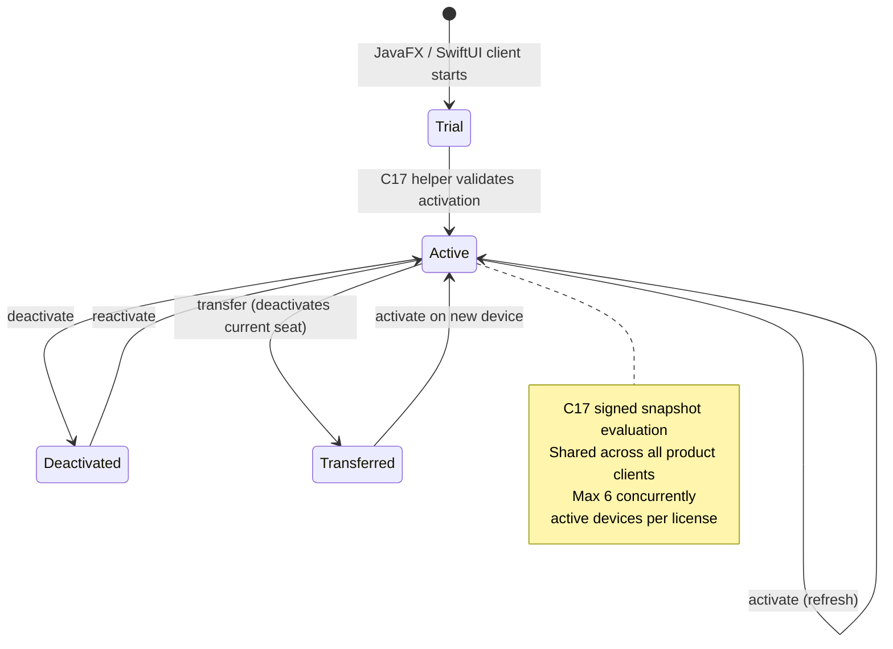

<!-- SPDX-FileCopyrightText: 2026 Pengfan Chang <support@swiphtgroup.com> -->
<!-- SPDX-License-Identifier: GPL-3.0-only -->

# License Validation

ClambHook uses the hosted `store.swiphtgroup.com` license backend for trial,
activation, device-seat, annual-subscription, paid-through, and supporter state. Official installers and
update manifests are served through GitHub Releases.

## Production Backend

The production license backend is hosted under:

`https://store.swiphtgroup.com/clambhook/license/v1/devices`

This repository does not contain the hosted license server. Backend deployment,
persistent storage, backups, rate limiting, payment webhooks, email delivery,
monitoring, and log redaction are maintained in the `swiphtgroup.com` store
infrastructure.

The application stores and transmits stable identifiers only through the hosted
license flow. The backend stores hashed license keys, checkout records, license
transactions, entitlement windows, generated install IDs, device display names,
platform and architecture values, app version values, activation state, and
transfer/deactivation events needed to support provider-neutral licensing. Profile
contents, traffic data, proxy credentials, and private keys are not uploaded for
license activation.

## Endpoints

- `POST /clambhook/license/v1/devices/activate` activates or refreshes a licensed device.
- `POST /clambhook/license/v1/devices/deactivate` deactivates a device seat before transfer or retirement.
- `POST /clambhook/license/v1/devices/reactivate` reactivates a known device when policy allows it.
- `POST /clambhook/license/v1/devices/transfer` records a transfer by deactivating the current device seat.
- Compatibility aliases under `/clambhook/license/v1/macos/*` may remain available for older macOS builds during migration.

Website checkout accepts `{ provider, email, licenseKey? }` through `/api/clambhook/checkout`.
ClambHook purchase payments are accepted only through Creem or NOWPayments, not
PayPal, and license transactions must originate from verified provider webhook
events in the `swiphtgroup.com` store.

Users can manage device seats from
`https://store.swiphtgroup.com/clambhook/portal/`.

## Client State and Helper Boundary

All clients evaluate the same signed state through the production
`clambhook-license` C17 helper. The GNU/Linux JavaFX client sends the frozen
`install-id`, `ensure-trial`, `status`, `activate`, `device-action`, and
`mark-verification-failure` requests to that helper. It stores the license key
in the desktop secret service using `secret-tool`, never in its JSON state.

GNU/Linux persists the install ID, email, signed snapshot, grant, and device
state in `$XDG_CONFIG_HOME/clambhook/linux-license.json`, falling back to
`~/.config/clambhook/linux-license.json`. A sibling `license-snapshot.json`
retains the signed snapshot used by runtime startup. Both files are replaced
atomically and created with user-only permissions. Android delegates secure
storage and lifecycle to the Kotlin platform AAR; macOS continues to use its
SwiftUI platform integration. Activation, deactivation, reactivation, and
transfer must survive a client restart on every platform.

## Distribution Contract

New installations include a 7-day trial; already-started legacy trials retain
their original month-long end date. A recurring USD 79.99 annual subscription
covers releases published during each paid term and up to six active devices.
Cancellation stops future billing at the paid-through date. Compatible releases
from paid terms remain usable perpetually, and resubscription can reuse the same
key. Public installers are downloaded from
`https://github.com/JohnThre/clambhook/releases`; only the protected release
workflow may publish generated installer artifacts.
