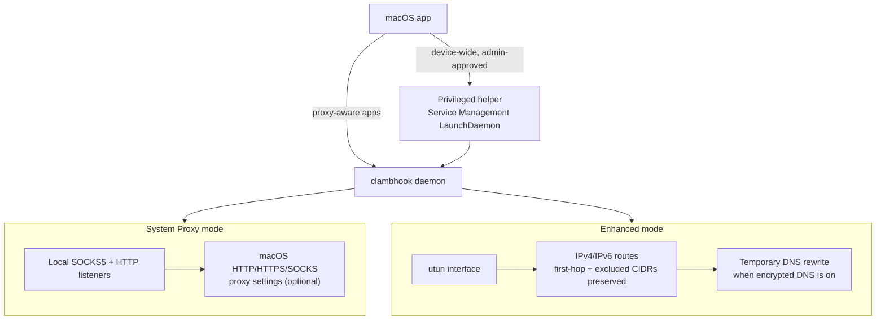

# macOS Scope

macOS uses daemon-backed routing only. The app does not embed Apple Network
Extension or System Extension targets, and it does not require the restricted
Network Extension entitlement.

## Included

- Install and approve a privileged Service Management LaunchDaemon helper.
- Launch the bundled `clambhook` daemon through the helper when privileged
  routing is required.
- System Proxy mode: expose local SOCKS5 and HTTP proxy listeners, then
  optionally configure macOS HTTP, HTTPS, and SOCKS proxy settings to point at
  those listeners.
- Enhanced Mode: create a macOS utun interface from the daemon, install IPv4
  and IPv6 routes, and route packets through the configured chain.
- In Enhanced Mode, preserve direct routes for the first proxy hop and configured
  excluded CIDRs before installing TUN routes.
- In Enhanced Mode, temporarily rewrite macOS DNS servers when the active
  profile enables encrypted DNS, then restore the previous DNS state when the
  daemon stops.
- Route test/explain requests and profile/rule edits through the daemon API.
- Show status, routing decisions, counters, and traffic history from the active
  daemon runtime.

## Limits

- Enhanced Mode requires admin approval for the privileged helper because utun,
  routes, and DNS changes are system-level operations.
- System Proxy mode is not device-wide; it only handles traffic from apps that
  honor macOS proxy settings.
- Per-process attribution and Little Snitch-style interactive prompts apply to
  proxied traffic (SOCKS5/HTTP listeners) via the daemon. System-wide, all-app
  attribution through a content-filter Network Extension needs Apple approval
  and is not part of this release.
- iOS, iPadOS, tvOS, visionOS, and Apple App Store distribution are outside the
  supported product scope.

## Packaging

The macOS app embeds `ClambhookMacHelper` under
`Contents/Library/HelperTools`, `org.jpfchang.clambhook.mac.helper.plist` under
`Contents/Library/LaunchDaemons`, and the signed `clambhook` daemon under
`Contents/MacOS`.

The app must not embed:

- `Contents/Library/SystemExtensions`
- `ClambhookMacTunnel.systemextension`
- `ClambhookMacFilter.systemextension`
- `ClambhookMobile.xcframework`

## Identifiers

- macOS app: `org.jpfchang.clambhook.mac`
- macOS widget extension: `org.jpfchang.clambhook.mac.widgets`
- macOS privileged helper label and Mach service:
  `org.jpfchang.clambhook.mac.helper`
- App Group: `group.org.jpfchang.clambhook`
- Keychain group: `V6GG4HYABJ.org.jpfchang.clambhook`
