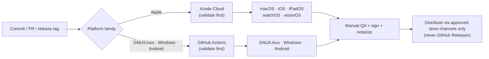
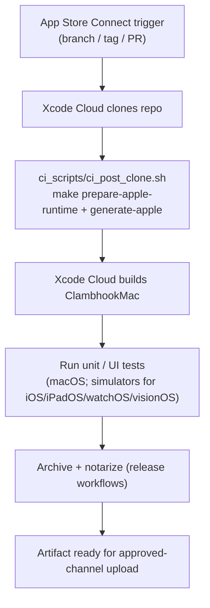
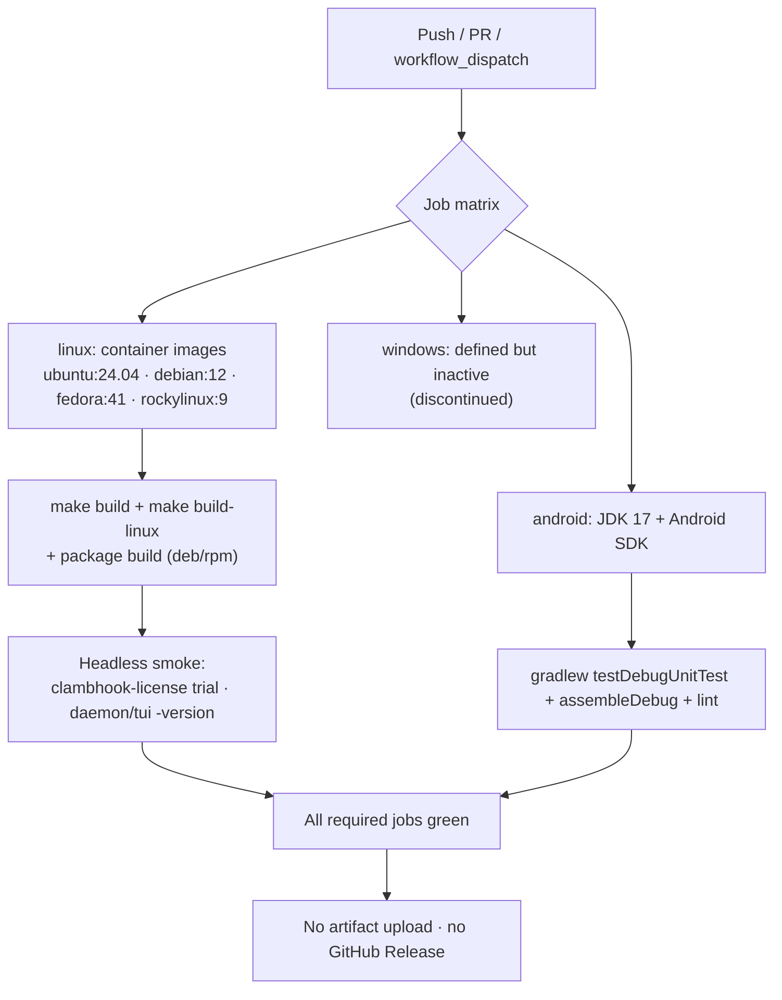

# Release Validation Policy

Every installer is validated in CI **before** any manual QA, signing, or upload
to an approved store channel. The CI system is chosen by platform family:

- **Apple platforms — Xcode Cloud first.** macOS, iOS, iPadOS, watchOS, and
  visionOS installers are built and tested on Xcode Cloud before release.
- **Non-Apple platforms — GitHub CI/CD first.** GNU/Linux, Windows, and Android
  installers are built and tested with GitHub Actions before release.

CI validates builds and installers; it never publishes end-user installers.
Distribution stays on the approved channels only (see
[`distribution.md`](distribution.md)). Nothing is uploaded to GitHub Releases.

## Ordering: CI gate before distribution

## Platform → CI → validation matrix

| Platform | CI system (first) | Build target | Validation | ClambHook status |
| --- | --- | --- | --- | --- |
| macOS | Xcode Cloud | `ClambhookMac` (`ui/apple`) | Build + `swift test` + notarized DMG smoke | Shipping (public) |
| iOS | Xcode Cloud | app + unit/UI tests | Build + tests on simulators | Not shipped for ClambHook |
| iPadOS | Xcode Cloud | app + unit/UI tests | Build + tests on simulators | Not shipped for ClambHook |
| watchOS | Xcode Cloud | watch app | Build + tests | Not shipped for ClambHook |
| visionOS | Xcode Cloud | vision app | Build + tests on simulator | Not shipped for ClambHook |
| GNU/Linux | GitHub Actions | `.deb` / `.rpm` / Flatpak / AppImage | Container build + headless smoke (`scripts/validate-linux-distros.sh`) | Shipping (public) |
| Windows | GitHub Actions | installer | Build + smoke | Discontinued (no planned resumption) |
| Android | GitHub Actions | `.apk` | `gradlew` unit tests + `assembleDebug` + lint | Internal developer QA |

ClambHook's Apple surface is currently macOS only; the iOS/iPadOS/watchOS/
visionOS lanes are defined so the same policy applies automatically if those
targets are added. Windows is discontinued, so its GitHub lane stays defined but
inactive until a Windows target returns.

## Apple lane — Xcode Cloud

Xcode Cloud runs the workflow attached to the app in App Store Connect. Because
the Apple project is generated with XcodeGen, the committed integration point is
[`ci_scripts/ci_post_clone.sh`](../ci_scripts/ci_post_clone.sh), which Xcode
Cloud runs after cloning and before resolving dependencies. It prepares the Go
daemon runtime and generates the Xcode project so the cloud build has a real
project to compile.

Configure the Xcode Cloud workflow in App Store Connect to:

1. Trigger on pull requests and on release tags.
2. Use `ci_scripts/ci_post_clone.sh` (auto-detected) to generate the project.
3. Build the `ClambhookMac` scheme and run the test action.
4. For release workflows, archive and notarize; do not attach artifacts to
   GitHub.

## Non-Apple lane — GitHub Actions

[`.github/workflows/installer-validation.yml`](../.github/workflows/installer-validation.yml)
validates the GNU/Linux and Android installers on every push, PR, and manual
dispatch. It builds and smoke-tests only — it uploads no installer artifacts and
creates no GitHub Release.

Distro-to-image mapping mirrors `packaging/README.md`: PureOS validates through
the Debian image (Debian-based) and Bazzite through the Fedora image plus the
Flatpak manifest.
