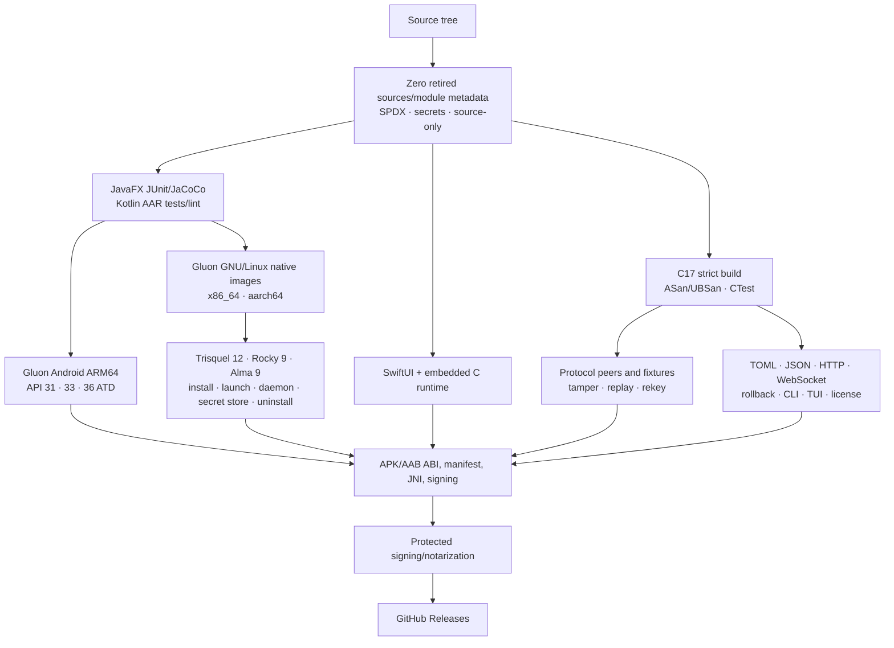

<!-- SPDX-FileCopyrightText: 2026 Pengfan Chang <support@swiphtgroup.com> -->
<!-- SPDX-License-Identifier: GPL-3.0-only -->

# Release validation

This document defines the evidence required before a protected ClambHook
release. It is also the completion checklist for the C17 and JavaFX/Gluon
architecture.

## Validation topology


```mermaid
flowchart TD
    source["Source tree"] --> policy["Zero retired sources/module metadata<br/>SPDX · secrets · source-only"]
    policy --> native["C17 strict build<br/>ASan/UBSan · CTest"]
    policy --> ui["JavaFX JUnit/JaCoCo<br/>Kotlin AAR tests/lint"]
    policy --> mac["SwiftUI + embedded C runtime"]
    native --> protocols["Protocol peers and fixtures<br/>tamper · replay · rekey"]
    native --> contracts["TOML · JSON · HTTP · WebSocket<br/>rollback · CLI · TUI · license"]
    ui --> android["Gluon Android ARM64<br/>API 31 · 33 · 36 ATD"]
    ui --> linux["Gluon GNU/Linux native images<br/>x86_64 · aarch64"]
    linux --> distros["Trisquel 12 · Rocky 9 · Alma 9<br/>install · launch · daemon · secret store · uninstall"]
    android --> inspect["APK/AAB ABI, manifest, JNI, signing"]
    distros --> inspect
    mac --> inspect
    protocols --> inspect
    contracts --> inspect
    inspect --> protected["Protected signing/notarization"]
    protected --> release["GitHub Releases"]
```

## C17 runtime gate

```sh
make test-native
```

The native gate uses `-Wall -Wextra -Wpedantic -Wconversion -Wshadow -Werror`
and ASan/UBSan. It covers:

- configuration defaults, imports/exports, mutation transactions, persisted
  backups, activation rollback, and malformed/oversized input;
- authenticated HTTP routes, WebSocket upgrade/framing/filtering, reconnect,
  event ordering, status/error envelopes, and API token handling;
- SOCKS5, HTTP forwarding, HTTPS interception, TUN packet handling, IPv4/IPv6,
  TCP/UDP, fragmentation, process attribution, and network changes;
- rule, policy, rule-set/subscription, prompt, temporary-rule, conditioner,
  DNS, geo, traffic, capture, CA, map/rewrite, breakpoint, and persistence
  behavior;
- WireGuard handshake/data, TCP/UDP routing, replay, rekey, keepalive, MTU,
  lifecycle, peer keys, and allowed IPs;
- OpenVPN UDP/TLS-EKM, AEAD data, PKI/user-password, malformed packets, replay,
  and explicit rejection of unsupported transport/crypto/control modes;
- VMESS-AEAD, ShadowTLS, Shadowsocks, Tor, direct, nested-chain, and policy
  selection fixtures;
- exact CLI/TUI version behavior and frozen license-helper JSON hashes.

The authoritative GNU/Linux protocol lane provisions real kernel WireGuard and
OpenVPN 2.6 loopback peers, exercises WireGuard TCP/UDP echo and an OpenVPN UDP
TLS-EKM data path, and fails if TUN privileges or peer tooling are unavailable.
The deterministic packet/control fixtures remain mandatory and are never
replaced by the peer smoke.

## JavaFX gate

```sh
make test-javafx
```

Tests cover typed route construction/decoding, event cursors, profile and
dashboard mapping, asynchronous success/failure/retry, background thread
boundaries, navigation state, keyboard accelerators, focus behavior, accessible
names/roles, compact and expanded layouts, scale-sensitive sizing, and color
contrast tokens. JaCoCo reports are retained as CI reports.

On GNU/Linux, each architecture builds `clambhook-ui` with Gluon, launches it
under Xvfb against an unavailable endpoint to exercise failure/retry without a
JRE, then launches it against the local C daemon.

## Android gate

```sh
make test-android
make build-android
make test-android-compatibility
```

API 31, 33, and 36 use `aosp_atd/arm64-v8a`. Required independent journeys:

1. consent grant and denial;
2. foreground-service notification and TUN traffic;
3. direct and encrypted routes;
4. network loss/reconnect and process restart;
5. revoke and always-on behavior;
6. per-application allow/bypass routing;
7. profile file and QR import/export;
8. profile, rule, policy, prompt, and temporary-rule mutation;
9. capture/CA/developer operations;
10. licensing activation/deactivation/cutoff;
11. updater check, signature/hash rejection, and install handoff.

The service-owned runtime must survive JavaFX activity closure. Each journey
fails on a crash, freeze, missing action target, or unmet expectation. Physical
devices are supplemental. API 30 is never substituted.

## GNU/Linux gate

```sh
scripts/validate-linux-distros.sh
make package-smoke
```

Both x86_64 and aarch64 lanes:

- build/test C17 and JavaFX;
- produce and launch the Gluon native image with no bundled JRE;
- install the C daemon/TUI/license helper and JavaFX UI;
- validate desktop/AppStream/icon metadata;
- validate systemd/polkit/sysusers/tmpfiles integration;
- use `secret-tool` for secure storage;
- install the native package, launch its C daemon, connect the TUI and JavaFX
  controller to the authenticated loopback API, exercise an ephemeral Secret
  Service/keyring, and then remove the package while checking that all payload
  registrations disappear;
- connect the UI to authenticated loopback HTTP/WebSocket;
- exercise the daemon and license helper;
- inspect architecture, dynamic dependencies, notices, and SBOM inputs;
- uninstall cleanly and verify package-owned paths are gone.

Trisquel produces Debian artifacts, Rocky produces RPM artifacts, and Alma
builds and installs an ephemeral package from the same RPM recipe as an
independent compatibility lane.

## macOS gate

```sh
make build-apple
make test-apple
make macos-release-contract-check
```

The SwiftUI application must embed the arm64 C17 `clambhook` and
`clambhook-tui` executables plus bundled OpenSSL, libsodium, libuv, and llhttp
libraries with bundle-relative install names. The signing check rejects
Homebrew paths, unexpected architectures, stale helpers, missing notices, or
unexpected extension payloads.

The protected release additionally verifies Developer ID signatures,
notarization, stapling, Gatekeeper, DMG contents, Sparkle signature/appcast,
SHA-256, and GPG signatures.

## Artifact and source gate

Before staging:

```sh
scripts/check-source-only.sh .
scripts/check-cutover.sh
scripts/check-license-policy.sh
scripts/check-github-actions.sh
git diff --check
```

After `git add -A`:

```sh
git diff --cached --check
git diff --cached --stat
git ls-files '*.go'
git ls-files go.mod go.sum vendor
```

The last two commands must print nothing. Inspect all packages to require:

- no JRE/JDK or obsolete UI payload;
- no retired runtime build-information section;
- no migration guards or suffixed executable names;
- only ARM64 native libraries in Android APK/AAB;
- correct application/bundle identifiers and API floors;
- correct C17 executables, JavaFX native image, licenses, notices, and update
  manifests.

## Delivery gate

Create one coherent cutover commit, push non-force to `origin/master`, and
monitor every required workflow. Fix defects with follow-up commits until all
required CI/security jobs pass. Do not create a release tag or manually publish
artifacts for source delivery.

Finish only when:

```sh
test "$(git rev-parse HEAD)" = "$(git rev-parse origin/master)"
test "$(git rev-parse HEAD)" = "$(git ls-remote origin refs/heads/master | awk '{print $1}')"
test -z "$(git status --porcelain)"
```
