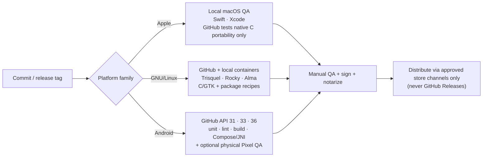

# Release Validation Policy

Every installer is validated **before** any manual QA, signing, or upload to an
approved store channel. GitHub Actions is the primary automated gate, with a
local mirror for physical-device and desktop QA. Nothing is attached to GitHub
Releases: workflow reports remain short-lived Actions artifacts and production
installers use only the approved R2-backed store channel.

`.github/workflows/ci.yml` runs source policy, native C portability, Android,
and GNU/Linux jobs. Android instrumentation covers API 31, 33, and 36; GNU/Linux is limited
to Trisquel 12, Rocky Linux 9, and AlmaLinux 9. `.github/workflows/security.yml`
runs CodeQL and dependency review. After these gates and owner QA,
`.github/workflows/release.yml` uses a protected GitHub environment to sign,
notarize, and deploy directly to R2 without GitHub installer artifacts. See
[`github-cicd.md`](github-cicd.md). `scripts/ci-local.sh` mirrors the platform
gate in sections
(`go`, `apple`, `android`, `linux`, `e2e`, `smoke`; default `all`), skipping any
section whose tooling is absent. CI validates builds and installers; it never
publishes end-user installers. Distribution stays on the approved channels only
(see [`distribution.md`](distribution.md)).

## Ordering: GitHub and local gates before distribution


```mermaid
flowchart LR
    commit["Commit / release tag"] --> gate{Platform family}
    gate -->|Apple| apple["Local macOS QA<br/>Swift · Xcode<br/>GitHub tests native C portability only"]
    gate -->|"GNU/Linux"| linux["GitHub + local containers<br/>Trisquel · Rocky · Alma<br/>C/GTK + package recipes"]
    gate -->|Android| android["GitHub API 31 · 33 · 36<br/>unit · lint · build · Compose/JNI<br/>+ optional physical Pixel QA"]
    apple --> qa["Manual QA + sign + notarize"]
    linux --> qa
    android --> qa
    qa --> dist["Distribute via approved store channels only<br/>(never GitHub Releases)"]
```

## Platform → validation matrix

| Platform | Where | Build target | Validation | ClambHook status |
| --- | --- | --- | --- | --- |
| macOS | Local app QA; GitHub native-C portability | `ClambhookMac` (`ui/apple`) | local `make build-apple` + `swift test` + notarized installer smoke; GitHub native C sanitizers | Shipping (public) |
| GNU/Linux | GitHub + local containers | Debian/RPM recipes | Trisquel 12, Rocky Linux 9, AlmaLinux 9; native sanitizers + C/GTK + package smoke | Shipping (public) |
| Android 12+ | GitHub + optional physical device | sideload build | unit/lint/build + Compose/JNI instrumentation on API 31/33/36 + optional Pixel 3a XL QA | Internal developer QA |

ClambHook's Apple surface is currently macOS only. Windows development is
discontinued with no planned resumption date.

## Apple lane — local app QA

The macOS app is built and tested only on the developer's Mac; the ordinary
GitHub CI macOS runner validates the portable native C runtime, not the app.
The protected release workflow may build, sign, notarize, and publish the app
after local validation. The Apple project is generated with XcodeGen; the current release still embeds the
legacy daemon while the C runtime follows the cross-platform parity gates.

```sh
make prepare-apple-runtime   # darwin daemon + TUI runtime
make generate-apple          # xcodegen generate
make build-apple             # xcodebuild ... build
make test-apple              # swift test --package-path ui/apple
```

For a release, `make release-macos` archives, Developer ID-signs, notarizes, and
staples the DMG. See
[`docs/website-release/release-runbook.md`](website-release/release-runbook.md).

## GNU/Linux lane — Trisquel, Rocky Linux, and AlmaLinux only

GNU/Linux is tested only on Trisquel 12, Rocky Linux 9, and AlmaLinux 9. GitHub
uses official Rocky/Alma images and constructs the Trisquel image from the
official signed Ecne package archive on x86-64. ARM64 local hosts can use the
official checksum-pinned Trisquel 12 base root filesystem. Optional local
validation uses Podman or Docker:

```sh
scripts/validate-linux-distros.sh            # Trisquel 12 · Rocky Linux 9 · AlmaLinux 9
make test-linux                              # host-side Kotlin unit tests for the Compose controller
```

During the phased C/GTK migration, run `make test-native` (including the
loopback SOCKS5/HTTP relay, Trojan/clambback TLS chain, all three Shadowsocks
AEAD-2018 TCP and UDP methods, direct UDP packet path, Tor SOCKS5 isolation,
Trojan/clambback TCP and UDP framing, VMESS-AEAD TCP and UDP with both body
ciphers,
ShadowTLS v3 over a genuine TLS 1.3 relay, nested encrypted chains,
stream-carried nested UDP chains, SOCKS5 UDP association/session reuse,
native Darwin/Linux TCP and UDP process attribution with an end-to-end process
rule decision, bounded Darwin/Linux network observation and first-match profile
switching, encrypted-DNS wire validation, Control D/bootstrap guards, real TLS
DoH and DoT exchanges, failover SERVFAIL behavior, nonce-exhaustion rejection,
native lwIP IPv4/IPv6 ICMP/checksum fixtures, configured TUN CIDRs, packet-stack
runtime/profile lifecycle cases, bounded IPv4/IPv6 TCP flow translation and
descriptor echo, IPv4/IPv6 UDP session reuse and tuple/checksum restoration,
encrypted-DNS port-53 interception and domain recovery, direct TUN route
dialing, bounded out-of-order IPv4/IPv6 fragment reassembly with overlap
rejection, common IPv6 extension-chain parsing, and Android JNI packet callback
compilation plus an API 31 delayed direct-UDP round trip),
plus `make build-linux-gtk` alongside the existing distro harness. Production
packages stay on their current binaries until the native packaging gate in
[`c-migration.md`](c-migration.md) passes. See
[`packaging/README.md`](../packaging/README.md) for the container-harness
details. For a release, `make release-linux` builds the
`.deb` + `.rpm`, checksums, GPG-signs, and writes the update manifest; see
[`docs/website-release/linux-release-runbook.md`](website-release/linux-release-runbook.md).

## Android lane — GitHub managed devices with optional physical-device QA

Android validates authoritatively in GitHub Actions; a developer's physical
Pixel is optional supplemental QA. The GUI is Kotlin/Jetpack Compose with an
Android 12 (API 31) floor. Gradle packages the NDK-built C/JNI runtime, the
production VPN factory selects it, and no gomobile AAR is packaged. The focused
native configuration/dashboard/route-explanation, profile-rule rebuild, raw-packet
callback, direct/encrypted route linkage, OpenSSL AEAD, direct-UDP/timer, and
encrypted-DNS DoT interception/failure-response tests must pass on API 31;
GitHub runs unit tests, lint, the debug build, and managed Compose/JNI devices
at API 31, 33, and 36. Android DoH configuration fails closed until libcurl is
available to the NDK build; plaintext fallback is forbidden. Google's
`android` CLI is the default for the local on-device dev loop. A physical Pixel
3a XL on Android 12/API 32 additionally passed focused instrumentation after
OpenSSL 3.5.8 LTS was statically linked
and C rule decisions were connected to native encrypted TCP/UDP chains. The
device run executes AES-128-GCM, AES-256-GCM, and ChaCha20-Poly1305 through JNI.
This supplements rather than replaces the API 31/33/36 matrix. The daemon-side
persistence path is also
covered by sanitizer-backed host tests that verify the active selection on
disk, the retained backup, and survival across runtime destruction/restart.
Native config export/import adds exact TOML round-trip, invalid-import
no-write, retained-backup, restart, and live HTTP header/response smoke checks;
config-derived DNS/settings/conditioner/subscription reads add rich-profile and
missing-profile fixtures. Structured DNS/settings/conditioner writes add
render-and-reparse validation, retained backups, restart survival, active
profile preservation, invalid-update no-write checks, an occupied-listener
transaction fixture that proves disk and service rollback, and a live HTTP
write/read/export smoke check. Ordered rule replacement/append and policy-
group/rule-set/subscription replacement add rendered-config, invalid-position,
restart, exact response-envelope, and live HTTP write/read fixtures. The
manual policy-selection fixture additionally checks group type/membership,
config-derived snapshot defaults, nested response compatibility, backup, and
restart persistence; active health-probe result parity remains a separate gate.
Developer-settings fixtures verify default limits/redaction lists, CA-path
omission, first-enable HTTPS acknowledgement, invalid-update byte-for-byte
no-write behavior, list normalization, retained backup, restart survival, and
a live HTTP hash/write/readback smoke check. This does not satisfy the native
developer capture/MITM data-plane gate.
Developer map/breakpoint/rewrite collection fixtures add nested-table
render/reparse validation, public `ops` mapping, complete persistence envelopes,
restart preservation, target-only deletion, encoded-path ID handling, and live
HTTP replace/read/delete coverage. Execution of those rules remains a separate
native data-plane gate.
Native rule-feed fixtures cover Go-equivalent hosts/adblock parsing, CIDR
masking, sorted de-duplication, exact SHA-256 cache naming, nanosecond timestamp
round trips, legacy cache reads, atomic version-1 writes, generated-rule
ordering, rule-set cache enrichment, selected-name validation, and rejection of
loopback/private/link-local/metadata/file destinations. A live native API smoke
refresh fetched a public hosts source, wrote and read back a cache, exposed nine
generated suffixes in `effective_rules`, and repeated successfully with
conditional cache metadata. Sanitizer tests, ten license differential cases,
and all four Android ABI builds remained green afterward. Android packages the
portable parser/cache reader; outbound refresh remains in the app-owned Kotlin
networking lane until native Android HTTP/TLS dependencies are selected.
The shared runtime continues to compile for every packaged Android ABI. When a
physical device is used for supplemental QA, keep it awake and dismiss its
keyguard before the Compose run; a locked device stops the test host activity
and produces a false `No compose hierarchies found` failure. An unavailable
physical device does not block the managed-device CI gate.

```sh
make build-android-native                    # NDK JNI library, all packaged ABIs
make test-android                            # ./gradlew :app:testDebugUnitTest
make lint-android                            # ./gradlew :app:lintDebug
make build-android                           # ./gradlew :app:assembleDebug
make test-android-compatibility              # managed AOSP devices: API 31/33/36
make run-android                             # android run (build + deploy + launch on a device or AVD)
```

For the on-device CI/CD gate, set `CI_LOCAL_ANDROID_AVD=<name>`; `scripts/ci-local.sh android` boots the AVD (`android emulator start`) and runs `make run-android` against it. Create an AVD with `android emulator create --name=clambhook --package="system-images;android-34;google_apis;arm64-v8a"`.

For a release, `make release-android` builds the AAR, assembles the release APK,
checksums, GPG-signs, and writes the update manifest. See
[`docs/android-development.md`](android-development.md) for the `android` CLI
guide and [`docs/website-release/release-runbook.md`](website-release/release-runbook.md).

## Local `release-check` scope

`make release-check` (`macos-release-contract-check test lint package-smoke
e2e-release`) currently gates the legacy core: it runs `go test ./...`, `go vet`, the Debian
package smoke build, and the real-server protocol e2e suite. It intentionally
does **not** run the UI test suites (`test-apple`, `test-android`,
`test-linux`); those are validated by `scripts/ci-local.sh` instead — the Apple
client via `make build-apple`/`test-apple`, the Android UI via `make
test-android`/`lint-android`/`build-android`, and the GNU/Linux UI via `make
test-linux` + `scripts/validate-linux-distros.sh`. Run the platform UI targets
directly when iterating on a specific client.

During migration, `make test-native` is an additional mandatory local gate.
After final cutover it replaces the legacy Go-specific checks rather than
running alongside them.
