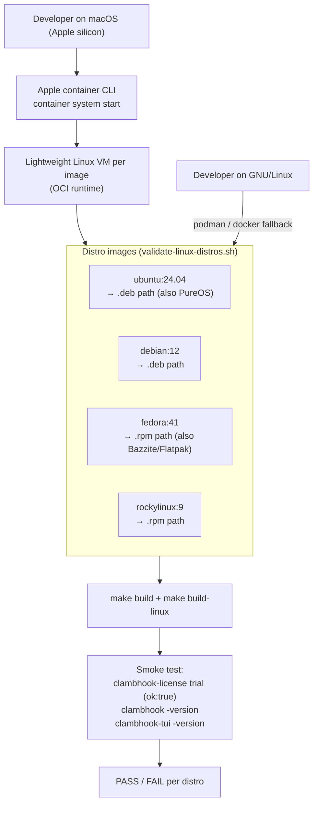

# ClambHook GNU/Linux packaging

ClambHook for GNU/Linux is distributed only from clambercloud.com as free
per-distro packages. Continued use after the one-month trial requires a license
purchased from store.swiphtgroup.com (Creem or NOWPayments; PayPal is not
accepted). Do not publish these installers on GitHub Releases or package
mirrors.

## Targets

| Distro | Package | Recipe |
| --- | --- | --- |
| Ubuntu, Debian, PureOS | `.deb` | `debian/` (`dpkg-buildpackage -us -uc -b`) |
| Fedora, Rocky Linux | `.rpm` | `packaging/rpm/clambhook.spec` |
| Bazzite, any distro | Flatpak | `packaging/flatpak/com.clambhook.Clambhook.yaml` |
| Any distro | AppImage | `packaging/appimage/build-appimage.sh` |

Every package installs the daemon (`clambhook`), the GTK/libadwaita desktop
controller (`clambhook-linux`), the terminal dashboard (`clambhook-tui`), and
the private license helper (`clambhook-license`) used for trial and license
activation.

## Privilege model (TUN / Enhanced mode)

- **System Proxy mode** needs no elevated privileges. It exposes local SOCKS5
  and HTTP listeners; the desktop app launches the daemon as the current user.
  This is the default in the sandboxed Flatpak and AppImage builds.
- **Enhanced / device-wide TUN routing** creates a TUN interface, installs
  routes, and rewrites DNS, which requires `CAP_NET_ADMIN` (and `CAP_NET_RAW`).
  The native `.deb`/`.rpm` packages install:
  - `packaging/systemd/clambhook-daemon.service` — a system service that runs
    the daemon with the required ambient capabilities.
  - `packaging/polkit/com.clambhook.Clambhook.policy` — a PolicyKit action so an
    active local user can start/stop that service with interactive
    authorization instead of a raw root shell.

Sandboxed Flatpak/AppImage builds cannot obtain `CAP_NET_ADMIN`, so they run in
System Proxy mode only. Use a native package for Enhanced mode.

## Validation

`scripts/validate-linux-distros.sh` does a headless build + smoke test of the
GNU/Linux app on every supported distribution in throwaway Linux containers.

It auto-selects a container engine:

- **macOS (Apple silicon):** Apple's [`container`](https://github.com/apple/container)
  tool, which runs each OCI Linux image inside a lightweight VM. This is how the
  real GNU/Linux installer is exercised from a Mac. Requires macOS 26 and a
  running service (`container system start`).
- **Linux:** falls back to `podman` (preferred) or `docker`.

```bash
# macOS one-time setup: install container from its GitHub releases, then:
container system start

# Validate all six distros (or pass one, e.g. fedora):
scripts/validate-linux-distros.sh
scripts/validate-linux-distros.sh fedora
```

Per distro the harness installs the build toolchain, runs `make build` +
`make build-linux`, then smoke-tests headlessly: `clambhook-license` seeds and
evaluates a trial (expects `"ok":true`), and `clambhook` / `clambhook-tui`
report their versions. GUI rendering is out of scope for headless containers and
is covered by the meson test suite plus manual desktop QA.



Distro-to-image mapping: PureOS validates through the Debian image (Debian-based)
and Bazzite through the Fedora image plus the Flatpak manifest (its supported
atomic channel).

This harness is also the GNU/Linux job in GitHub Actions
(`.github/workflows/installer-validation.yml`), which runs the non-Apple
installer validation before release. Apple platforms validate on Xcode Cloud.
See [`../docs/release-validation.md`](../docs/release-validation.md) for the full
policy and diagrams.
