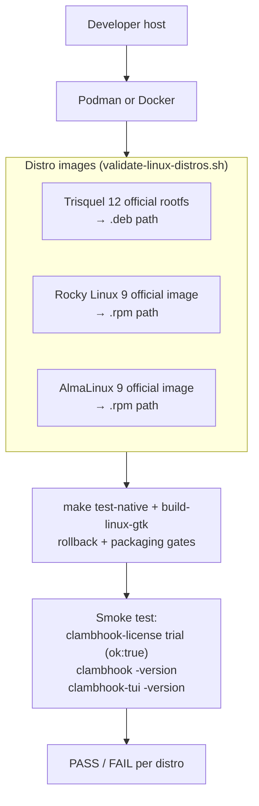

# ClambHook GNU/Linux packaging

ClambHook for GNU/Linux is distributed only from clambercloud.com as free
per-distro packages. Continued use after the one-month trial requires a license
purchased from store.swiphtgroup.com (Creem or NOWPayments; PayPal is not
accepted). Do not publish these installers on GitHub Releases or package
mirrors.

## Targets

| Distro | Package | Recipe |
| --- | --- | --- |
| Trisquel | `.deb` | `debian/` (`dpkg-buildpackage -us -uc -b`) |
| Rocky Linux, AlmaLinux | `.rpm` | `packaging/rpm/clambhook.spec` |

Current packages install the daemon (`clambhook`), the legacy Kotlin/Compose
Multiplatform desktop controller (`clambhook-linux`), the terminal dashboard
(`clambhook-tui`), and the private license helper (`clambhook-license`) used for
trial and license activation. The C daemon/helper and C/GTK 4 client are
additive migration targets and must not enter release packages before the
parity and no-Go packaging gates in
[`../docs/c-migration.md`](../docs/c-migration.md) pass.

## Privilege model (TUN / Enhanced mode)

- **System Proxy mode** needs no elevated privileges. It exposes local SOCKS5
  and HTTP listeners; the desktop app launches the daemon as the current user.
- **Enhanced / device-wide TUN routing** creates a TUN interface, installs
  routes, and rewrites DNS, which requires `CAP_NET_ADMIN` (and `CAP_NET_RAW`).
  The native `.deb`/`.rpm` packages install:
  - `packaging/systemd/clambhook-daemon.service` — a system service that runs
    the daemon with the required ambient capabilities.
  - `packaging/polkit/com.clambhook.Clambhook.policy` — a PolicyKit action so an
    active local user can start/stop that service with interactive
    authorization instead of a raw root shell.

## Validation

`scripts/validate-linux-distros.sh` does a headless build + smoke test of the
GNU/Linux app on exactly Trisquel 12, Rocky Linux 9, and AlmaLinux 9 in
throwaway Linux containers. GitHub Actions runs the same harness; it is also
the GNU/Linux section of `scripts/ci-local.sh`.

It auto-selects a supported local container engine:

- **Podman** is preferred.
- **Docker** is the fallback.

```bash
# Validate all three supported distros (or pass one):
scripts/validate-linux-distros.sh
scripts/validate-linux-distros.sh trisquel
scripts/validate-linux-distros.sh rocky
scripts/validate-linux-distros.sh alma
```

Per distro the harness installs the build toolchain, runs sanitizer-backed C
tests, builds the C/GTK client, validates the rollback runtime and desktop
controller while migration remains active, and builds the matching Debian/RPM
recipe. GUI rendering is out of scope for headless containers and remains a
manual desktop QA gate.


```mermaid
flowchart TD
    dev["Developer host"] --> tool["Podman or Docker"]
    subgraph distros["Distro images (validate-linux-distros.sh)"]
        trisquel["Trisquel 12 official rootfs\n→ .deb path"]
        rocky["Rocky Linux 9 official image\n→ .rpm path"]
        alma["AlmaLinux 9 official image\n→ .rpm path"]
    end
    tool --> distros
    distros --> build["make test-native + build-linux-gtk\nrollback + packaging gates"]
    build --> smoke["Smoke test:\nclambhook-license trial (ok:true)\nclambhook -version\nclambhook-tui -version"]
    smoke --> pass["PASS / FAIL per distro"]
```

See [`../docs/release-validation.md`](../docs/release-validation.md) for the
full release-validation policy and diagrams.
