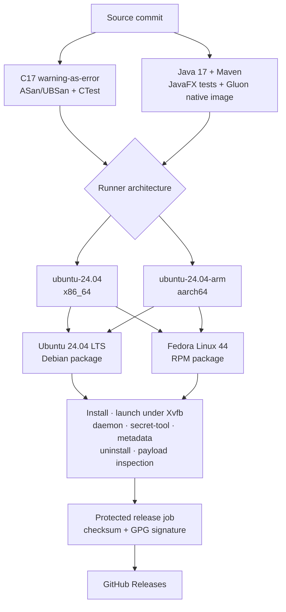

<!-- SPDX-FileCopyrightText: 2026 Pengfan Chang <support@swiphtgroup.com> -->
<!-- SPDX-License-Identifier: GPL-3.0-only -->

# Packaging

GNU/Linux packages contain the C17 `clambhook` daemon, `clambhook-tui`,
`clambhook-license`, and the self-contained `clambhook-ui` Gluon native image.
They do not bundle a JRE. Android packages are ARM64 Gluon APK/AAB files with
the Kotlin platform AAR and C17 JNI runtime. macOS embeds the C binaries in the
SwiftUI application.

## GNU/Linux payload

The Debian and RPM recipes install:

- `/usr/bin/clambhook`
- `/usr/bin/clambhook-tui`
- `/usr/bin/clambhook-license`
- `/usr/bin/clambhook-ui`
- `org.jpfchang.clambhook.desktop` and matching AppStream metadata/icon
- `clambhook-daemon.service`
- the ClambHook polkit policy, sysusers/tmpfiles metadata, sample config,
  licenses, notices, and documentation

The JavaFX image uses system graphics/audio libraries but carries its Java
runtime as native code. Package inspection rejects JAR/JRE payloads, retired UI
artifacts, unexpected executables, and runtime build metadata from the retired
implementation.

The controller probes the loopback API before connecting. If the packaged
daemon is not ready, `PlatformServices` starts `clambhook-daemon.service`
through systemd and waits for the C17 API before sending the connect request.
Closing the JavaFX window never stops the system daemon.

## Authoritative distro matrix

| Distribution | Architectures | Role |
| --- | --- | --- |
| Ubuntu 24.04 LTS | x86_64, aarch64 | Build/test Debian package |
| Fedora Linux 44 | x86_64, aarch64 | Build/test RPM package |

Both lanes use their official container images on native-architecture GitHub
runners. Ubuntu and Fedora are the only authoritative GNU/Linux test targets.


```mermaid
flowchart TD
    commit["Source commit"] --> native["C17 warning-as-error<br/>ASan/UBSan + CTest"]
    commit --> javafx["Java 17 + Maven<br/>JavaFX tests + Gluon native image"]
    native --> matrix{"Runner architecture"}
    javafx --> matrix
    matrix --> x64["ubuntu-24.04<br/>x86_64"]
    matrix --> arm["ubuntu-24.04-arm<br/>aarch64"]
    x64 --> ubuntu["Ubuntu 24.04 LTS<br/>Debian package"]
    arm --> ubuntu
    x64 --> fedora["Fedora Linux 44<br/>RPM package"]
    arm --> fedora
    ubuntu --> inspect["Install · launch under Xvfb<br/>daemon · secret-tool · metadata<br/>uninstall · payload inspection"]
    fedora --> inspect
    inspect --> protected["Protected release job<br/>checksum + GPG signature"]
    protected --> github["GitHub Releases"]
```

Run the matrix locally with Podman or Docker:

```sh
scripts/validate-linux-distros.sh
scripts/validate-linux-distros.sh ubuntu
scripts/validate-linux-distros.sh fedora
```

Container isolation is optional locally. Hosted lanes are authoritative.
Apple's `container` CLI is not used.

## Recipe validation

`scripts/ci-linux-package-recipes.sh debian` builds the Debian recipe inside
Ubuntu. `scripts/ci-linux-package-recipes.sh rpm` builds the RPM recipe inside
Fedora. `scripts/package-smoke.sh` validates metadata, production binary
names, desktop integration, daemon unit hardening, JavaFX native image launch,
license helper contract, expected architecture, absence of a bundled JRE, and
clean uninstall behavior.

## Release files

For each GNU/Linux architecture, the protected workflow produces:

- `ClambHook-<version>-<arch>.deb`
- `ClambHook-<version>-<arch>.rpm`
- `clambhook-linux-<arch>-manifest.json`
- SHA-256 files and armored detached GPG signatures

The Android release produces `ClambHook-arm64.apk`,
`ClambHook-arm64.aab`, a signed update manifest, checksums, and detached GPG
signatures. The macOS release produces the signed/notarized Apple Silicon DMG,
ZIP, update manifest, checksum, appcast, and signatures.

Ordinary CI uploads reports only. Packaging or publication is allowed only in
`.github/workflows/release.yml` after its environment protections and signing
checks pass.

See [release validation](../docs/release-validation.md) and
[distribution policy](../docs/distribution.md).
