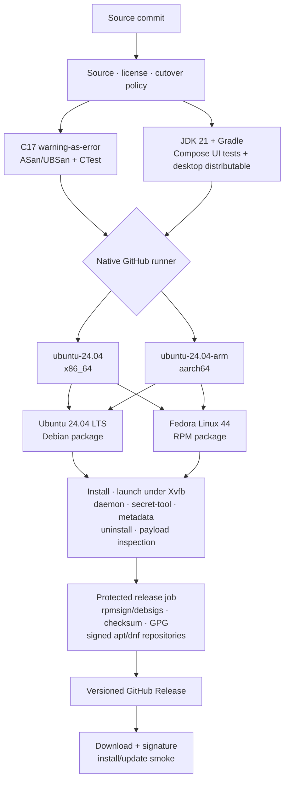

<!-- SPDX-FileCopyrightText: 2026 Pengfan Chang <support@swiphtgroup.com> -->
<!-- SPDX-License-Identifier: GPL-3.0-only -->

# Packaging

GNU/Linux packages contain the C17 `clambhook` daemon, `clambhook-tui`,
`clambhook-license`, and the self-contained `clambhook-ui` Kotlin/Compose
desktop controller with its private jlink runtime. Ubuntu and Fedora are the
only supported distributions. Android packages are ARM64 Kotlin/Compose
APK/AAB files with the Kotlin platform library and C17 JNI runtime. macOS embeds the C binaries in the
SwiftUI application.

## GNU/Linux payload

The Debian and RPM recipes install:

- `/usr/bin/clambhook`
- `/usr/bin/clambhook-tui`
- `/usr/bin/clambhook-license`
- `/usr/bin/clambhook-ui` → `/usr/lib/clambhook/ui/bin/clambhook-ui`
- `/usr/lib/clambhook/ui/` (Compose Desktop distributable with a private
  OpenJDK 21 jlink runtime; no system JRE dependency)
- the signed repository configuration: on Ubuntu
  `/etc/apt/sources.list.d/clambhook.sources` and
  `/usr/share/keyrings/clambhook-archive-keyring.asc`; on Fedora
  `/etc/yum.repos.d/clambhook.repo` and
  `/etc/pki/rpm-gpg/RPM-GPG-KEY-clambhook`
- `org.jpfchang.clambhook.desktop` and matching AppStream metadata/icon
- `clambhook-daemon.service`
- the ClambHook polkit policy, sysusers/tmpfiles metadata, sample config,
  licenses, notices, and documentation

The desktop controller uses the system X11, fontconfig, and freetype libraries.
Its only Java runtime is the private image under `/usr/lib/clambhook/ui`.
Package inspection rejects Java runtimes outside that directory, retired
JavaFX/Gluon/GTK payloads, unexpected executables, and runtime build metadata
from the retired implementation.

The controller probes the loopback API before connecting. If the packaged
daemon is not ready, `PlatformServices` starts `clambhook-daemon.service`
through systemd and waits for the C17 API before sending the connect request.
Closing the desktop window never stops the system daemon.

## Authoritative distro matrix

| Distribution | Architectures | Role |
| --- | --- | --- |
| Ubuntu 24.04 LTS | x86_64, aarch64 | Build/test Debian package |
| Fedora Linux 44 | x86_64, aarch64 | Build/test RPM package |

Both lanes use their official container images on native-architecture GitHub
runners. Ubuntu and Fedora are the only authoritative GNU/Linux test targets.


```mermaid
flowchart TD
    commit["Source commit"] --> policy["Source · license · cutover policy"]
    policy --> native["C17 warning-as-error<br/>ASan/UBSan + CTest"]
    policy --> kotlin["JDK 21 + Gradle<br/>Compose UI tests + desktop distributable"]
    native --> matrix{"Native GitHub runner"}
    kotlin --> matrix
    matrix --> x64["ubuntu-24.04<br/>x86_64"]
    matrix --> arm["ubuntu-24.04-arm<br/>aarch64"]
    x64 --> ubuntu["Ubuntu 24.04 LTS<br/>Debian package"]
    arm --> ubuntu
    x64 --> fedora["Fedora Linux 44<br/>RPM package"]
    arm --> fedora
    ubuntu --> inspect["Install · launch under Xvfb<br/>daemon · secret-tool · metadata<br/>uninstall · payload inspection"]
    fedora --> inspect
    inspect --> protected["Protected release job<br/>rpmsign/debsigs · checksum · GPG<br/>signed apt/dnf repositories"]
    protected --> github["Versioned GitHub Release"]
    github --> verify["Download + signature<br/>install/update smoke"]
```

Run the matrix locally with Podman or Docker:

```sh
scripts/validate-linux-distros.sh
scripts/validate-linux-distros.sh ubuntu
scripts/validate-linux-distros.sh fedora
```

Container isolation is optional locally. Hosted lanes are authoritative.
Apple's `container` CLI is not used.

## Recipe validation

`scripts/ci-linux-package-recipes.sh debian` builds the Debian recipe inside
Ubuntu. `scripts/ci-linux-package-recipes.sh rpm` builds the RPM recipe inside
Fedora. `scripts/package-smoke.sh` validates metadata, production binary
names, desktop integration, daemon unit hardening, desktop controller launch,
license helper contract, expected architecture, the private-runtime layout, and
clean uninstall behavior.

## Release files

For each GNU/Linux architecture, the protected workflow produces:

- `ClambHook-<version>-<arch>.deb` with an embedded `debsigs` origin signature
- `ClambHook-<version>-<arch>.rpm` with an embedded RPM header signature
- `clambhook-linux-<arch>-manifest.json`
- SHA-256 files and armored detached GPG signatures (`.sig`) for every package,
  checksum, and manifest

After both architectures are published, the `linux-repo` job builds the signed
apt and dnf repositories (`InRelease`/`Release.gpg`, `repomd.xml.asc`). It
installs from them in Ubuntu 24.04 and Fedora 44 containers with signature
checking enabled, proves that tampered metadata is refused, and publishes
`clambhook-linux-repo-<version>.tar.gz` (signed). That tree is deployed to
`https://jpfchang.org/clambhook/linux/`. All signatures use the
developer@jpfchang.org key; see
[release signing](../docs/website-release/signing.md).

The Android release produces `ClambHook-arm64.apk`,
`ClambHook-arm64.aab`, a signed update manifest, checksums, and detached GPG
signatures for each installer and checksum. The macOS release produces the
signed/notarized Apple Silicon DMG and ZIP, each with a detached GPG signature,
plus their signed checksums, a signed update manifest, and a signed Sparkle
appcast.

Ordinary CI uploads reports only. Packaging or publication is allowed only in
`.github/workflows/release.yml` after its environment protections and signing
checks pass. The generated asset list is a release contract, not evidence that
the GitHub Release currently exists.

See [release validation](../docs/release-validation.md) and
[distribution policy](../docs/distribution.md).
