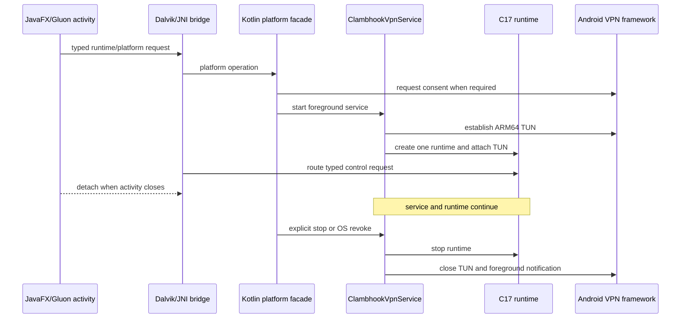

<!-- SPDX-FileCopyrightText: 2026 Pengfan Chang <support@swiphtgroup.com> -->
<!-- SPDX-License-Identifier: GPL-3.0-only -->

# Android platform AAR

This module contains Android framework integration only. It has no
user-facing activity hierarchy beyond short-lived permission/QR bridges; the
Gluon JavaFX application in `ui/javafx` owns every product screen.

The Kotlin AAR retains `VpnService`, TUN ownership, foreground-service and
notification lifecycle, consent/revoke handling, encrypted secure storage,
signed updater support, QR/file sharing, installed-app inventory, and per-app
routing. `ClambhookVpnService` owns the single in-process C17 runtime. Closing
or recreating the JavaFX activity only detaches the controller and never
destroys that runtime.

The locked application ID is `org.jpfchang.clambhook`; `minSdk` is 31,
`targetSdk` is 36, `compileSdk` is 37, and product APK/AAB output is
ARM64-only. Portable C tests may still use other Android ABIs.

Run `make test-android` for Kotlin unit tests, lint, native compilation, and the
ARM64-only release AAR. Authoritative managed-device journeys run
`aosp_atd/x86_64` images on API 31, 33, and 36 using Ubuntu 24.04 hosted
runners with KVM. Only the debug test package gains the x86_64 JNI slice; this
does not expand the supported product ABI. With the repository Android
CLI installed, use `android info`, `android emulator list`,
`android emulator start <name>`, and
`android run --device <serial> --apks <apk>` for supplemental local journeys.
Use `adb logcat --pid=$(adb shell pidof org.jpfchang.clambhook)` when runtime
logs are needed. See
[`docs/android-development.md`](../../docs/android-development.md).
