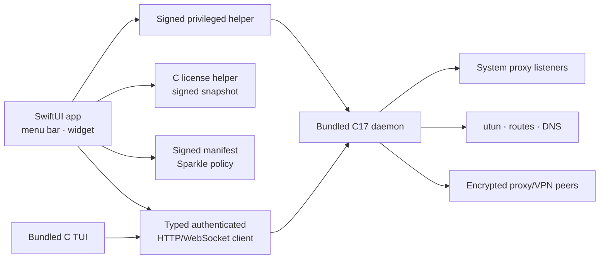

<!-- SPDX-FileCopyrightText: 2026 Pengfan Chang <support@swiphtgroup.com> -->
<!-- SPDX-License-Identifier: GPL-3.0-only -->

# macOS SwiftUI client

macOS 14 and later retains the native SwiftUI application. It communicates
only with the bundled production C17 daemon and ships the C TUI plus required
native dynamic libraries. No retired runtime or compatibility executable is
embedded.

Run `make build-apple` for an unsigned application build and `make test-apple`
for the shared Swift package tests. `make macos-release-contract-check`
validates the release product, licensing copy, and C-only bundle contract.
Signing, notarization, and publication remain confined to the protected
release workflow; local validation does not publish artifacts.
