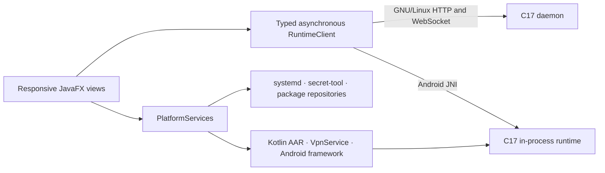

<!-- SPDX-FileCopyrightText: 2026 Pengfan Chang <support@swiphtgroup.com> -->
<!-- SPDX-License-Identifier: GPL-3.0-only -->

# Shared JavaFX application

This is the only user interface shipped on Android and GNU/Linux. It targets
Java 17, JavaFX 21.0.12, Gluon's JavaFX 21.0.1 static SDK, and GluonFX 1.0.29.
The view covers connection state, profiles and configuration transfer,
activity, servers and chains, policies, rules, DNS/firewall/conditioner,
prompts, developer tools, settings, licensing, and updates.

`RuntimeClient` owns the frozen JSON and control-route types. It never exposes
HTTP, JNI, or Android lifecycle objects to views. `PlatformServices` owns VPN
consent/lifecycle, file and QR operations, secure storage, clipboard/browser,
notifications, per-app routing, licensing, updates, and GNU/Linux daemon
supervision. The GNU/Linux transport accepts loopback HTTP(S) origins only,
uses the same bearer token for HTTP and WebSocket requests, validates the
WebSocket upgrade, and reconnects the event stream without blocking JavaFX.

Run `make test-javafx` from the repository root. The suite uses a real JavaFX
toolkit to exercise keyboard shortcuts, accessible names, responsive
navigation, 48-pixel interaction targets, contrast, failure/retry behavior,
and asynchronous transport. GNU/Linux CI runs these tests under Xvfb.

For GNU/Linux, set `GRAALVM_HOME` to the checksum-pinned Java 17 toolchain and
run `make build-linux`. The output is a self-contained x86_64 or aarch64 native
image under `target/gluonfx/<architecture>-linux/`; no JRE is packaged.
The Maven configuration pins the application resources, reflection roots,
native-image arguments, and Android JNI boundary explicitly so reachability
metadata does not depend on host-side tracing. Its desktop and Android
profiles register only their own backend and platform-service implementations.
On GNU/Linux, license keys live in the system secret service through
`secret-tool`; the install ID and signed C-helper state are atomically written
with private permissions under `$XDG_CONFIG_HOME/clambhook/` (or
`~/.config/clambhook/`).

For Android, first run `scripts/prepare-gluon-android.sh`, then run
`mvn -B -Pandroid gluonfx:build gluonfx:package`. The package step emits a
signed or development ARM64 APK and AAB and merges the Kotlin platform AAR.
