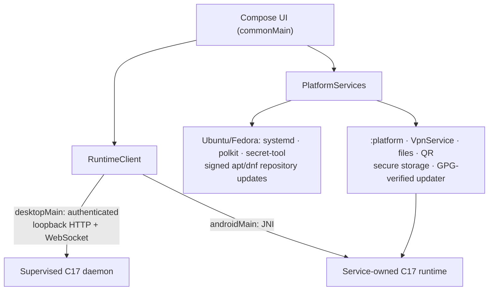

<!-- SPDX-FileCopyrightText: 2026 Pengfan Chang <support@swiphtgroup.com> -->
<!-- SPDX-License-Identifier: GPL-3.0-only -->

# Kotlin application (Android and GNU/Linux)

This Gradle build holds the only user interface shipped on Android and
GNU/Linux. It is written entirely in Kotlin with Compose Multiplatform 1.11, on
Kotlin 2.4, AGP 9.3, and the pinned Gradle 9.7.1 wrapper. On GNU/Linux, Ubuntu
and Fedora are the only supported distributions.

| Module | Contents |
| --- | --- |
| `:shared` | Kotlin Multiplatform: the Compose UI (`commonMain`), the typed `RuntimeClient` and `PlatformServices` boundaries, JSON contracts, and the dashboard model. `desktopMain` holds the loopback HTTP/WebSocket backend (OkHttp) and the Ubuntu/Fedora platform services. `androidMain` holds the in-process JNI backend and Android platform services. |
| `:platform` | Android library: `ClambhookVpnService`, TUN, the JNI C runtime, consent, QR, secure storage, licensing, per-app routing, and the signed updater. |
| `:app` | Android application `org.jpfchang.clambhook` (minSdk 31, targetSdk 36, ARM64 only). |
| `:desktop` | GNU/Linux entry point, packaged as a Compose Desktop distributable with a private jlink runtime and installed as `clambhook-ui`. |



`RuntimeClient` owns the frozen JSON and control-route types and never exposes
HTTP, JNI, or Android lifecycle objects to views. The GNU/Linux transport
accepts loopback HTTP(S) origins only and uses the same bearer token for HTTP
and WebSocket requests. `ClambhookVpnService` owns the single Android runtime,
so closing the activity only detaches the UI.

## Build and test

```sh
make test-linux       # shared + desktop tests (Compose UI under Xvfb on headless Linux)
make build-linux      # Compose Desktop distributable (Ubuntu or Fedora host; needs jpackage + jmods)
make test-android     # :platform unit tests and lint, :app lint, release APK
make build-android    # release APK and App Bundle
```

The Android modules are configured only when an Android SDK is found
(`ANDROID_HOME`, `ANDROID_SDK_ROOT`, or `local.properties`). Pass
`-Pclambhook.desktopOnly=true` to force a desktop-only build, as the Ubuntu and
Fedora package builds do implicitly.

The Android build stays on the stable API 36 SDK. `androidx.core` 1.19+,
`okhttp-android` 5.5+, and Compose 1.12+ need compileSdk 37, so they are pinned
below those versions and excluded from Dependabot.

## Signing and updates

Android release builds read the keystore from the
`CLAMBHOOK_ANDROID_KEYSTORE_*` environment that
`scripts/prepare-ci-android-signing.sh` sets up. The application ID and keystore
never change, so existing installs upgrade in place. The in-app updater accepts
a manifest and APK only when their detached `.sig` files verify against the
bundled developer@jpfchang.org key (`ReleaseSignatureVerifier`, Bouncy Castle),
and only when the SHA-256 also matches.

On GNU/Linux, updates come only from the signed apt (Ubuntu) or dnf (Fedora)
repository that the package configures. On any other distribution, the desktop
updater reports that updates are unsupported.

License keys live in the Secret Service via `secret-tool`. The install ID and
signed helper state are written atomically with private permissions under
`$XDG_CONFIG_HOME/clambhook/`.
